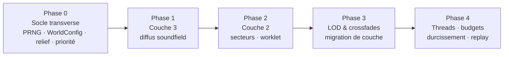

# Plan de migration — du diorama (Couche 1) au moteur de son stratifié

> **Objet** : itinéraire d'implémentation depuis le code **actuel** (prototype « diorama », Couche 1 seule) vers la **cible** figée par [`SPEC-MOTEUR-SON.md`](./SPEC-MOTEUR-SON.md) (moteur stratifié 3 couches, échelle paramétrable, replay déterministe).
> **Nature** : la spec fige le *contrat* (structures, flux, invariants). Ce document fige le *chemin* : phases, livrables, fichiers touchés, critères de sortie, risques.
> **Stratégie retenue** : **fondations d'abord** — sécuriser déterminisme + échelle + verticalité avant d'empiler les couches.
> **Règle d'or de la migration** : à la fin de **chaque** phase, l'application tourne, s'écoute, et la **boîte noire** reste verte (aucun événement de trace régressé). On ne casse jamais le diorama pour construire le champ.

---

## Sommaire

1. [État des lieux — code actuel vs cible](#1-état-des-lieux--code-actuel-vs-cible)
2. [Clôture des points ouverts (§16 de la spec)](#2-clôture-des-points-ouverts-16-de-la-spec)
3. [Invariants de migration](#3-invariants-de-migration)
4. [Vue d'ensemble des phases](#4-vue-densemble-des-phases)
5. [Phase 0 — Socle transverse](#5-phase-0--socle-transverse)
6. [Phase 1 — Couche 3 (diffus lointain)](#6-phase-1--couche-3-diffus-lointain)
7. [Phase 2 — Couche 2 (texture moyenne, secteurs)](#7-phase-2--couche-2-texture-moyenne-secteurs)
8. [Phase 3 — LOD & crossfades](#8-phase-3--lod--crossfades)
9. [Phase 4 — Threads, budgets & durcissement](#9-phase-4--threads-budgets--durcissement)
10. [Cartographie fichier par fichier](#10-cartographie-fichier-par-fichier)
11. [Traçabilité invariants → phases](#11-traçabilité-invariants--phases)
12. [Risques transverses & mitigations](#12-risques-transverses--mitigations)

---

## 1. État des lieux — code actuel vs cible

Le code vit dans `ds/ui_kits/diorama/`. C'est le **prototype v0** : la **Couche 1 seule**, avec une instrumentation déjà mûre. Les fondations structurelles (repère unique, boîte noire causale, voix possédées par les grains) sont **conformes à l'esprit de la cible** ; le reste est surtout **additif**.

### 1.1 Ce qui est déjà là et conforme

| Brique cible | Où | Statut |
|---|---|---|
| Repère monde unique, conversions centralisées (I5) | `coords.js` (`makeCoords`, `worldToResonance`, `headInputToWorld`) | ✅ « piège du Z » isolé |
| Orientation auditeur fixe & ancrée monde (§11) | `coords.js:46` `LISTENER_FORWARD`, posée dans `RainSampler.init` | ✅ |
| 6 faces d'écoute (§2.2) | `coords.js:52` `HEAD_FACES`, projection dans `traceSample` | ✅ |
| Pool de voix, le grain **possède** sa position (§5.3) | `RainSampler.js` `Voice`/`VoicePool` | ✅ plus de télescopage |
| HRTF binaural objet (§11 Couche 1) | sources Resonance `scene.createSource` | ✅ |
| Tap analyser master = niveau réel post-spatialisation (§10.3) | `RainSampler.js` `_masterAnalyser`, `getMasterLevel` | ✅ |
| Boîte noire NDJSON causale, double horloge, deltas, anneau (§13) | `TraceRecorder.js` | ✅ format `rompiche-trace/1` |
| Événements Couche 1 : `session/header/state/impact/reject/trigger/acquire/steal/release/env/faces` | `RainSampler.js` + `DioramaApp.jsx` | ✅ |
| Modèle terrain (matériau 0,5 m + relief 1 m) (§15.1) | `Terrain.js` | ✅ donnée présente (relief pas encore *consommé*) |
| Registre matériaux + atténuation min/max (§15.3) | `materials.js` | ✅ consommé dans `VoicePool.play` |

### 1.2 Divergences (le travail à faire)

| # | Sujet (réf. spec) | État actuel | Cible | Phase |
|---|---|---|---|---|
| D-1 | **Stratification** (§3) | 1 couche, 1 pool | 3 couches soudées par crossfades | 1-3 |
| D-2 | **Moteur d'échelle** (§4) | `SIZE` codé en dur (`DioramaApp.jsx:10`), pas de `r1`/`r2` | `WorldConfig` + presets + frontières dérivées + collapse | 0 |
| D-3 | **Déclenchement Poisson** (§5.1) | piloté par le **visuel** : wrap de phase de 80 gouttes (`WireframeCube.jsx:257-285`) | processus de Poisson `λ(t)` sur le game thread, PRNG seedé | 0 |
| D-4 | **Points d'impact bakés / relief** (§5.2) | (x,z) au sol + hack `Y_FLATTEN=0.25` (`RainSampler.js:17,315`) | `PointImpact` avec hauteur réelle + `expoCiel` + normale → **débloque la face HAUT** | 0 |
| D-5 | **Vol par priorité** (§5.3) | vol par **âge** (`_oldest()`, `RainSampler.js:144`) | `priorité = w_gain·gain + w_dist·(1−dist) + w_att·attention − w_age·âge` | 0 |
| D-6 | **Anti-répétition + déterminisme** (§5.4, I4) | `Math.random()` (sample `RainSampler.js:318`, detune `DioramaApp.jsx:122`) | round-robin + jitter via **PRNG seedé** | 0 |
| D-7 | **Couche 2** (§6) | absente | granulateurs par secteurs (AudioWorklet), secteurs adaptatifs | 2 |
| D-8 | **Couche 3** (§7) | absente | nappes de bruit filtré, soundfield Resonance | 1 |
| D-9 | **Crossfades & LOD** (§8) | absent | promotion/démotion + hystérésis | 3 |
| D-10 | **Séparation threads** (§9, I6) | tout sur le main thread (RAF React) ; aucun AudioWorklet | game thread (décision) / audio thread (worklets) + ring buffer | 4 |
| D-11 | **Instrumentation étendue** (§13.2) | événements Couche 1 OK ; `header` sans `seed` ; `faces` sans `fwd/up/size/steals` ; `env` sans `weak` | + `scale/sector/bed/crossfade/lod/budget` + champs manquants | 0-3 (au fil de l'eau) |
| D-12 | **Replay déterministe** (§14) | impossible (pas de seed) | modes A (re-trigger) et B (re-simulation) | 0 + 4 |
| D-13 | **Modèles `WorldConfig`/`LayerConfig`/`BakedSet`** (§15) | absents | déclarés et consommés | 0 |
| D-14 | **Budgets plateforme + culling + coupe grains faibles** (§12) | pool fixe 48, ordre 3 (`RainSampler.js:7,13`) ; pas de presets ni de `weak` | presets mobile/desktop/VR, attention, coupe `< seuilWeakDb` | 4 |

> **Dette annexe** : les commentaires du code référencent `SYSTEME-SURFACES.md`, fichier absent du dépôt (ancienne spec, désormais remplacée par `SPEC-MOTEUR-SON.md`). À reciter au passage dans `materials.js`, `coords.js`, `Terrain.js`.

---

## 2. Clôture des points ouverts (§16 de la spec)

Les 5 points ouverts de la spec sont **tranchés ici**. Trois décisions directionnelles (validées avec le porteur), deux valeurs de calibration verrouillées par recommandation.

### §16.1 — Décodage de la Couche 3 → **Source soundfield Resonance** ✔ *(validé)*

La nappe diffuse est routée dans une **source « soundfield » de Resonance**, partageant l'**unique décodage binaural** déjà en place pour les Couches 1/2.

- **Pourquoi** : un seul pipeline, un seul décodage, cohérent avec la `ResonanceAudio` scene existante (`RainSampler.init`). Le diffus (ordre 1) n'a pas besoin d'un contrôle d'ordre indépendant.
- **Conséquence** : pas de décodeur ambisonic FOA séparé dans le graphe (§10.2 simplifié). Le graphe §10.2 « alternative » devient le **chemin par défaut**.
- **Repli** : si un besoin d'ordre supérieur indépendant émerge (improbable au diffus), on isolera un décodeur dédié — interface stable, sans réécriture du reste.

### §16.2 — Granularité des secteurs (Couche 2) → **Adaptative à l'échelle** ✔ *(validé)*

Le nombre de secteurs `N` dérive de `WorldConfig`/plateforme, jamais en dur (I3) :

| preset | `N` secteurs |
|---|---|
| `diorama` | — (Couche 2 OFF, cf. §4.2) |
| `room` | 4 |
| `courtyard` | 8 |
| `field` | 12 |

- **Pourquoi** : aligné sur le moteur d'échelle (§4) et les presets plateforme (§12.2 : mobile 4, desktop 8, VR 8-12). Évite la sur-résolution au diorama et la sous-résolution en grand champ.
- **Conséquence** : `LayerConfig.L2.sectors` est résolu par `résoudreCouches()` (§4.1) au moment du changement d'échelle ; chaque secteur reste **un** granulateur AudioWorklet.

### §16.3 — Coût des points bakés → **Bake borné + streaming par zone** *(recommandation verrouillée)*

- **Diorama / petits mondes** (`worldRadius ≤ r1`, ~4-12 m) : bake **intégral en mémoire**. Densité plafonnée à l'échantillonnage du terrain (cellule 0,5 m ⇒ ≤ 4 points/m²) ; négligeable.
- **Grands mondes** (`field` 80 m) : seuls les points dans un rayon `r1 + marge` autour de l'auditeur sont **résidents** ; le reste est **streamé par zone** via l'index spatial (`BakedSet.index`, grille/BVH §15.2). Au-delà de `r1`, les Couches 2/3 prennent le relais et **n'ont pas besoin** de points individuels.
- **Conséquence** : le coût mémoire du bake suit la **surface du champ proche** (bornée par `r1`), pas la surface totale du monde. **Acceptable** sur toutes les plateformes.
- **À valider** : temps de bake hors-ligne d'un champ 80 m (objectif : < 1 s, sinon bake incrémental par chunk).

### §16.4 — Hystérésis LOD `h` → **Fraction de l'overlap, départ `0,5 × overlap`** *(recommandation verrouillée)*

- `h = clamp(0,5 × overlap, 0,3 m, ∞)` : **proportionnelle à l'échelle** (jamais en dur, I3), avec un plancher absolu (~0,3 m) pour éviter le flottement au diorama.
- Complétée par un **anti-rebond temporel** (~150 ms) sur la re-bascule, pour l'auditeur oscillant pile sur la frontière.
- **À calibrer via la trace** : compter dans les événements `lod` les bascules rapprochées `A→B→A` (< 300 ms). Objectif : quasi nul en déplacement nominal.

### §16.5 — Variations HD par matériau → **≥ 8 (champ proche), 12-16 (matériaux durs)** *(recommandation verrouillée)*

- **Couche 1** : minimum **8** variations/matériau, **12-16** pour les matériaux à transitoires marqués (métal, surfaces dures). Combiné au round-robin + jitter (`detune`/`gain`/`filtre`) seedé, repousse le seuil de répétition au-delà de la cadence d'impact typique.
- **Couches 2/3** : grain noyé dans la densité ⇒ **4-6** variations suffisent.
- **Règle** : le round-robin ne rejoue jamais le même couple `(sample, detune quantifié)` dans une fenêtre de `N ≥ taille de banque` grains.
- **Test d'oreille** : densité max sur un seul matériau ⇒ aucune périodicité audible.

---

## 3. Invariants de migration

En plus des 7 invariants de la spec (I1-I7), la **migration** impose ses propres garde-fous :

| # | Invariant de migration | Vérification |
|---|---|---|
| **M1** | À chaque fin de phase, l'app **tourne et s'écoute** (le diorama n'est jamais cassé). | Lancement manuel + écoute. |
| **M2** | La **boîte noire reste verte** : aucun événement existant ne disparaît ni ne régresse. | Diff de schéma sur une trace de référence. |
| **M3** | Tout nouvel aléa passe par le **PRNG seedé** dès son introduction (jamais `Math.random`). | `grep -r "Math.random"` doit rester vide dans le moteur après Phase 0. |
| **M4** | Toute frontière/budget dérive de la **config**, jamais d'une constante en dur. | Revue : aucune distance/voix magique hors `WorldConfig`/`LayerConfig`. |
| **M5** | Chaque couche/feature ajoutée **émet sa trace** dès sa première ligne de code. | L'événement de trace est écrit *avant* la logique (conçu *avec*, I4). |
| **M6** | **Pas de couture audible** lors de l'activation d'une couche (crossfade, pas de coupe). | Écoute + recherche `steal.remaining > 0` dans la trace. |

---

## 4. Vue d'ensemble des phases

| Phase | Cœur | Lève les divergences | Invariants spec sécurisés |
|---|---|---|---|
| **0** | Déterminisme, échelle, verticalité, priorité | D-2, D-3, D-4, D-5, D-6, D-11(partiel), D-13 | I3, I4, I5 |
| **1** | Couche 3 diffuse (la plus simple, coût constant) | D-8, D-11 | I1, I7 |
| **2** | Couche 2 (secteurs, AudioWorklet) | D-7, D-11 | I1 |
| **3** | LOD & crossfades (souder les couches) | D-1, D-9, D-11 | I2, I7 |
| **4** | Threads, budgets plateforme, replay complet | D-10, D-12, D-14 | I2, I6 |

> **Pourquoi Couche 3 avant Couche 2** : le diffus est le plus simple (coût constant, pas de positionnement individuel, pas de worklet granulaire complexe) et c'est **exactement** ce dont le diorama a besoin (§4.2 : `1 + 3 mince`). Il valide la chaîne « nouvelle couche → mix → trace » sur le cas le moins risqué avant d'attaquer les secteurs.

---

## 5. Phase 0 — Socle transverse

> **But** : rendre le moteur **déterministe**, **paramétrable en échelle**, et corriger le **défaut de verticalité** — sans encore ajouter de couche. À la sortie, le diorama sonne *pareil ou mieux*, mais il est **rejouable** et **prêt à grandir**.

### 5.1 Livrables

1. **PRNG seedé** (nouveau `prng.js`)
   - Générateur à état explicite reproductible (ex. *mulberry32* / *xoshiro*), interface `aléa() ∈ [0,1)`.
   - Remplace **tous** les `Math.random` du moteur : choix de sample (`RainSampler.js:318`), `detune` (`DioramaApp.jsx:122`), et le futur Poisson.
   - `seed` ajouté à `WorldConfig` et **journalisé dans le `header`** (`TraceRecorder.toNDJSON`).

2. **`WorldConfig` + moteur d'échelle** (nouveau `worldConfig.js`)
   - Structure `WorldConfig` (§2.3) + `LayerConfig` (§15.4) + presets `diorama/room/courtyard/field` (§4.3).
   - `résoudreCouches(worldRadius, cfg) → { r1, r2, overlap }` (§4.1) + logique de collapse (§4.2).
   - `SIZE` codé en dur (`DioramaApp.jsx:10`) remplacé par `cfg.size`. Au diorama : `r1 = 2,5`, Couche 2 OFF.
   - Émet l'événement de trace **`scale`** au montage et à tout changement de preset/size.

3. **Processus de Poisson sur le game thread** (dans `RainSampler` ou nouveau `RainManager`)
   - Découple le **déclenchement audio** de la **détection visuelle** : `λ(t) = densitéPluie × surfaceExposée × facteurMatériau` (§5.1), intervalle exponentiel `−ln(aléa())/λ` via PRNG.
   - Le visuel (`WireframeCube`) **reste** la couche de présentation, mais n'est plus la *source de vérité* des impacts audio (suppression progressive du couplage `onImpact` par wrap de phase, `WireframeCube.jsx:257-285`). Étape transitoire acceptable : garder le visuel piloté par le même PRNG pour cohérence œil/oreille.

4. **Points d'impact bakés + relief** (nouveau `BakedSet`, extension `Terrain`)
   - `PointImpact { position(x,y,z avec hauteur réelle), normale, matériau, expoCiel }` (§5.2).
   - Bake hors temps réel : échantillonne la surface, raycast vertical vers le ciel → `expoCiel`, lit `normale` + `matériau` depuis `Terrain` (le relief `height`, déjà présent mais inutilisé, devient **consommé**).
   - La sélection d'impact tire dans le `BakedSet` pondéré par `expoCiel × densité`.
   - **Supprime le hack `Y_FLATTEN`** (`RainSampler.js:17`) : la hauteur vient désormais du relief réel ⇒ **la face HAUT reçoit enfin de l'énergie** (corrige le défaut structurel §2.2).

5. **Vol de voix par priorité** (`VoicePool`)
   - Remplace `_oldest()` (`RainSampler.js:144`) par `priorité(voix) = w_gain·gainNorm + w_dist·(1−distNorm) + w_att·attention − w_age·âgeNorm` (§5.3).
   - `attention` = champ de vision/focus (culling perceptuel) ; pondérations dans `LayerConfig.L1.priorité`.
   - L'événement `steal` gagne `prio` et `victim.remaining` (déjà partiellement présent).

6. **Instrumentation : compléter le contrat existant**
   - `header` : ajouter `seed` + version moteur (`meta`).
   - `faces` : ajouter `head.fwd/up`, `size`, `steals` (aujourd'hui `RainSampler.js:364` n'émet que `head{x,y,z}` + `busy`).
   - `env` : ajouter le flag `weak?` (prépare la coupe des grains négligeables, Phase 4).
   - Nouvel événement **`scale`**.

### 5.2 Fichiers touchés

`+ prng.js` · `+ worldConfig.js` · `+ BakedSet.js` · `~ coords.js` (échelle depuis config) · `~ Terrain.js` (relief consommé, bake) · `~ RainSampler.js` (Poisson, priorité, suppression Y_FLATTEN, trace) · `~ TraceRecorder.js` (seed dans header) · `~ DioramaApp.jsx` (WorldConfig, suppression SIZE en dur) · `~ WireframeCube.jsx` (découplage impact visuel/audio).

### 5.3 Critères de sortie (Definition of Done)

- [ ] `grep -r "Math.random"` **vide** dans `ds/ui_kits/diorama/` (hors visuel pur non audible). *(M3)*
- [ ] Deux exécutions même `seed` + même timeline `state` ⇒ **mêmes** événements `trigger` (mêmes `sample`/`detune`/`grain`). *(§14, I4)*
- [ ] La trace montre de l'énergie sur la face **HAUT** : `jq -r 'select(.type=="faces")|.db[4]' trace.ndjson | grep -v null | wc -l` **> 0**. *(§13.4, défaut verticalité corrigé)*
- [ ] Changer `preset` en session ⇒ événement `scale` émis, **aucun artefact** audible. *(§4.4)*
- [ ] Au diorama, Couche 2 OFF et collapse vers `1 + 3 mince` câblé (la nappe arrive en Phase 1). *(§4.2)*
- [ ] Boîte noire verte : tous les événements Couche 1 préexistants toujours émis. *(M2)*

### 5.4 Risques de la phase

- **Découpler le visuel de l'audio** peut désynchroniser œil/oreille → mitigation : un seul PRNG partagé pilote les deux pendant la transition.
- Le **bake du relief** sur un terrain aujourd'hui plat (`makeDefaultTerrain` ne remplit que le matériau) → introduire un relief de test non trivial pour *prouver* la face HAUT.

---

## 6. Phase 1 — Couche 3 (diffus lointain)

> **But** : ajouter l'**enveloppement de fond** à coût quasi constant. Le diorama gagne son « wash » de pluie tout autour (§7.2). C'est la couche la plus simple : on valide la chaîne « nouvelle couche → mix → trace » sur le cas le moins risqué.

### 6.1 Livrables

1. **Générateur de nappe** (nouveau `DiffuseBed.js` + AudioWorklet de bruit)
   - `AudioWorkletProcessor` de bruit (pink/brown) → filtre passe-bande → **source soundfield Resonance** (décision §16.1).
   - `NappeDiffuse { source, filtre passe-bande modulé météo, niveau f(intensité) }` (§7.1).
   - Modulation par la **météo globale** (intensité, vent) — pas par impacts.
2. **Branchement dans le graphe** (§10.2, chemin soundfield) — un seul décodage binaural, partagé avec la Couche 1.
3. **Collapse diorama** : à `worldRadius ≤ r1`, la nappe passe en mode **mince** (enveloppement non localisé) — complète le câblage de la Phase 0.
4. **Trace** : nouvel événement **`bed`** (`niveau`, `filtre{centre,largeur}`, `ordre`, `weatherSv`) émis au changement.

### 6.2 Fichiers touchés

`+ DiffuseBed.js` · `+ worklets/noise-processor.js` · `~ RainSampler.js` (intègre la nappe au graphe + mix) · `~ DioramaApp.jsx` (la météo pilote le niveau de nappe).

### 6.3 Critères de sortie

- [ ] Pluie ON ⇒ nappe audible, enveloppante, **sans pulsation** (continue).
- [ ] Intensité météo module ouverture/centre du filtre ⇒ événements `bed` cohérents.
- [ ] Couche 1 + Couche 3 mixées **sans baisse de headroom** ni saturation (vérif via `getMasterLevel`).
- [ ] Au diorama : enveloppement présent **sans** voix HRTF supplémentaire dépensée. *(§4.2)*

---

## 7. Phase 2 — Couche 2 (texture moyenne, secteurs)

> **But** : faire le **pont** entre impacts distincts (Couche 1) et nappe (Couche 3). Granulaire dense, **par secteurs adaptatifs** (décision §16.2), non positionné individuellement.

### 7.1 Livrables

1. **Granulateur AudioWorklet** (nouveau `worklets/granulator-processor.js`)
   - Par secteur : flux continu de grains courts piochés dans les banques matériau du secteur, débit piloté par la densité locale, intervalles de Poisson **seedés** (§6.2).
   - Applique l'occlusion locale (atténuation + passe-bas).
2. **Découpage en secteurs adaptatifs** (nouveau `SectorField.js`)
   - `N` dérivé de l'échelle (4/8/12 — §16.2), chaque secteur encodé dans sa direction (source statique Resonance par secteur, §10.2).
   - Densité par secteur modulée par la **géométrie locale** (couverture matériau, occlusion, réflexions précoces — §6.3).
3. **Absorption depuis la Couche 1** : un impact au-delà de `r1 − overlap` n'est plus instancié en voix héros (§5.5) → il alimente la **densité** du secteur correspondant. *(le LOD complet vient en Phase 3)*
4. **Trace** : nouvel événement **`sector`** (~30 Hz : `secteur`, `débit`, `level`, `occlusion`, `matMix`). Pas d'événement par grain (trop dense) — **enveloppe agrégée** par secteur (§6.4).

### 7.2 Fichiers touchés

`+ worklets/granulator-processor.js` · `+ SectorField.js` · `~ RainSampler.js` (route les impacts lointains vers les secteurs, intègre au mix) · `~ worldConfig.js` (résolution de `N` secteurs).

### 7.3 Critères de sortie

- [ ] Secteurs audibles, **directionnels** (gauche/droite/devant/derrière distincts).
- [ ] Densité d'un secteur suit la géométrie (un secteur sous abri ⇒ `occlusion` ↑, `level` ↓ dans la trace).
- [ ] Transition Couche 1 → densité secteur **sans trou rythmique** ni saut de niveau.
- [ ] `N` secteurs varie correctement avec le preset (`room`=4, `field`=12).

---

## 8. Phase 3 — LOD & crossfades

> **But** : **souder** les trois couches. Une source migre de couche selon sa distance, avec hystérésis et fondus à puissance constante — **aucune couture audible** (I7).

### 8.1 Livrables

1. **Crossfade à puissance constante** (§8.1) dans la zone `[r − overlap, r]` : `g_haut = sin(t·π/2)`, `g_bas = cos(t·π/2)`.
2. **Machine à états LOD** (§8.2) avec **hystérésis `h`** (décision §16.4 : `0,5 × overlap`, plancher 0,3 m, anti-rebond 150 ms) :
   - Démotion L1→L2 : voix héros relâchée (fondu), énergie versée dans la densité du secteur.
   - Promotion L2→L1 : impact proche redevient voix héros si budget dispo, sinon reste en densité.
   - L2↔L3 analogue.
3. **LOD comme levier de budget** (§8.3) : sous pression (pool saturé), abaisser `r1` ⇒ moins de voix héros, plus de densité/nappe.
4. **Trace** : nouveaux événements **`crossfade`** (`from`, `to`, `g_bas`, `g_haut`) et **`lod`** (`from`, `to`, `dist`, `reason`).

### 8.2 Fichiers touchés

`+ LodController.js` · `~ RainSampler.js` (applique fondus + migrations) · `~ SectorField.js` / `~ DiffuseBed.js` (reçoivent l'énergie démotée).

### 8.3 Critères de sortie

- [ ] Auditeur traversant `r1`/`r2` ⇒ **aucun clic, aucun trou** (écoute + `jq 'select(.type=="steal" and .victim.remaining>0)'` proche de zéro). *(M6)*
- [ ] Pas de **papillonnement** aux frontières : bascules `lod` `A→B→A` rapprochées quasi nulles (validation §16.4).
- [ ] Sous pression budget, `r1` s'abaisse et `budget`/`lod` le tracent.

---

## 9. Phase 4 — Threads, budgets & durcissement

> **But** : honorer la **séparation des threads** (I6), les **budgets plateforme** (I2), le **replay complet** (§14), et les optimisations finales.

### 9.1 Livrables

1. **Séparation game / audio thread** (§9) : décision (Poisson, sélection, météo, LOD) sur le game thread ; rendu (worklets, Resonance) sur l'audio thread ; communication par **ring buffer / messages non bloquants**. Remontée de compteurs (busy, steals, niveaux) pour LOD/budget.
2. **Presets plateforme** (§12.2) : `mobile/desktop/VR` → voix L1, secteurs L2, ordre ambisonique, sample rate. Le pool fixe 48 / ordre 3 (`RainSampler.js:7,13`) devient un **dérivé de plateforme**.
3. **Optimisations** (§12.3) : culling par attention/champ de vision, **coupe des grains négligeables** (`< seuilWeakDb` ⇒ libère la voix ; le flag `weak` posé en Phase 0 devient actionnable), pré-mixage des textures denses (§7).
4. **Replay déterministe complet** (§14) : modes **A (re-trigger)** et **B (re-simulation)** depuis la trace + `seed` ; nouvel événement **`budget`** (~1 Hz). Outil de relecture rejouant les ordres horodatés sur le même graphe Web Audio.

### 9.2 Fichiers touchés

`+ ReplayEngine.js` · `+ ringBuffer.js` · `~ RainSampler.js` / `~ RainManager.js` (passage en messages) · `~ worldConfig.js` (presets plateforme) · `~ DioramaApp.jsx` (sélection plateforme + UI replay debug).

### 9.3 Critères de sortie

- [ ] Aucun calcul lourd ne bloque le rendu audio (profil : pas d'underrun worklet).
- [ ] Mode B : re-simulation depuis `seed` + timeline ⇒ flux d'événements **identique** au live (toute divergence = régression, §14.5).
- [ ] Presets plateforme effectifs (mobile : 12-16 voix, ordre 1).
- [ ] `env.weak==true` ⇒ voix effectivement coupée et libérée (vérif `jq` du compte).

---

## 10. Cartographie fichier par fichier

| Fichier | Aujourd'hui | Évolution cible |
|---|---|---|
| `coords.js` | repère + échelle dérivée de `size` + 6 faces | échelle pilotée par `WorldConfig` ; reste le point unique du « piège du Z » |
| `materials.js` | 3 matériaux, min/max distance | + variations HD (§16.5), + `seuilWeakDb` ; reciter la doc |
| `Terrain.js` | matériau (0,5 m) + relief (1 m) **non consommé** | relief **consommé** par le bake ; source du `BakedSet` |
| `RainSampler.js` | Couche 1 : pool, vol par âge, Y_FLATTEN, trace C1 | Poisson, vol par **priorité**, suppression Y_FLATTEN, intègre C2/C3, LOD, messages |
| `TraceRecorder.js` | boîte noire NDJSON, événements C1 | + `seed` au header ; reçoit `scale/sector/bed/crossfade/lod/budget` |
| `DioramaApp.jsx` | état React, météo, SIZE en dur | `WorldConfig`, presets, pilotage nappe/secteurs, UI replay |
| `WireframeCube.jsx` | visuel + **source des impacts** (wrap de phase) | visuel **seul** ; impacts déplacés vers le game thread/Poisson |
| **(nouveaux)** | — | `prng.js`, `worldConfig.js`, `BakedSet.js`, `DiffuseBed.js`, `SectorField.js`, `LodController.js`, `ReplayEngine.js`, `ringBuffer.js`, `worklets/*.js` |

---

## 11. Traçabilité invariants → phases

| Invariant spec | Sécurisé en | Preuve (critère de sortie) |
|---|---|---|
| **I1** Perceptuel, pas physique | 1, 2 | Poisson + matériaux + nappe diffuse audibles |
| **I2** Budget fini & profilé | 3, 4 | LOD comme levier ; presets plateforme |
| **I3** Échelle paramétrable | 0 | `scale` émis ; aucune frontière en dur (M4) |
| **I4** Observable & rejouable | 0, 4 | même `seed` ⇒ mêmes `trigger` ; replay mode B identique |
| **I5** Un seul repère | déjà ✅ | conversions isolées dans `coords.js` |
| **I6** Threads séparés | 4 | pas d'underrun worklet sous charge |
| **I7** Dégradation gracieuse | 0, 1, 3 | collapse diorama + crossfades sans couture (M6) |

---

## 12. Risques transverses & mitigations

| Risque | Impact | Mitigation |
|---|---|---|
| **Casser le diorama** en empilant les couches | Régression silencieuse | M1/M2 : app écoutable + boîte noire verte à chaque fin de phase |
| **Déterminisme partiel** (un `Math.random` oublié) | Replay faux, I4 violé | M3 : `grep` zéro après Phase 0 ; test « même seed ⇒ même trace » en garde |
| **Latence du bake** sur grands mondes | Démarrage lent | §16.3 : streaming par zone, bake incrémental par chunk |
| **Papillonnement LOD** aux frontières | Artefacts audibles | §16.4 : hystérésis proportionnelle + anti-rebond, validée par la trace |
| **Saturation du mix** quand 3 couches jouent | Clipping | Tap master (`getMasterLevel`) surveillé ; limiteur au master (§10.2) |
| **Couplage visuel/audio** rompu trop tôt | Œil/oreille désync | Phase 0 : PRNG partagé pendant la transition |
| **Coût AudioWorklet** (granulateurs) sur mobile | Underrun | Presets plateforme (Phase 4) + secteurs adaptatifs (4 sur mobile) |
| **Périodicité audible** du round-robin | Réalisme dégradé | §16.5 : ≥ 8 variations + jitter seedé ; test densité max |

---

### Points à calibrer (hérités des recommandations, à affiner par la trace)

1. Pondérations de priorité `w_gain/w_dist/w_att/w_age` (§5.3) — départ équilibré, ajuster au compteur de `steal`.
2. Valeur exacte de `h` et de l'anti-rebond (§16.4) — affiner sur les bascules `lod`.
3. Nombre de variations par matériau (§16.5) — valider à l'oreille à densité max.
4. Frontières `r1/r2` et `crossfade` par preset (§4.3) — valeurs indicatives à calibrer.
5. Budgets plateforme (§12.2) — profiler tôt (I2).
