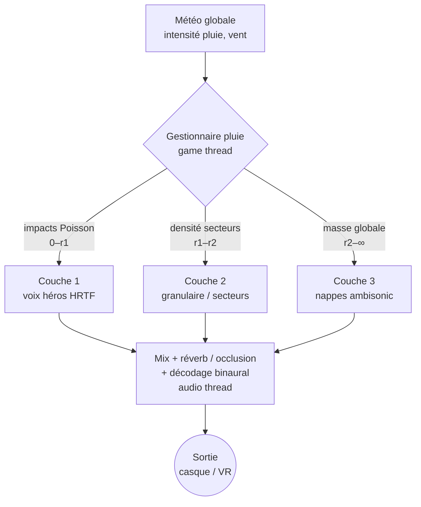
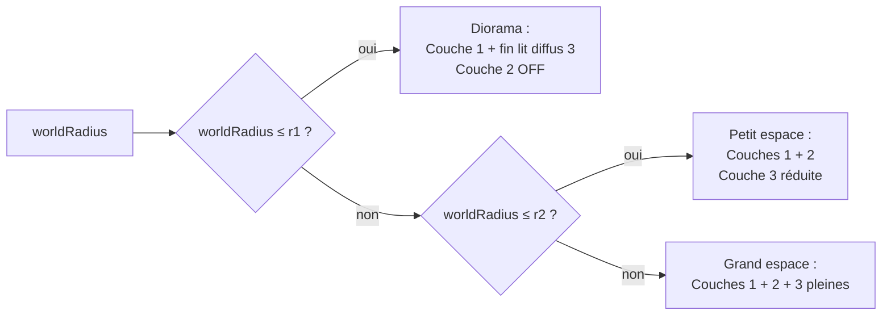
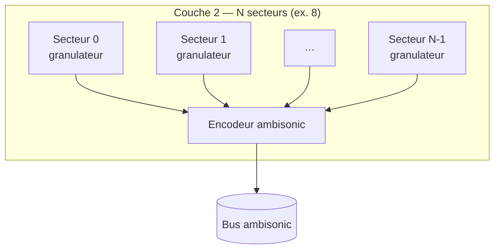
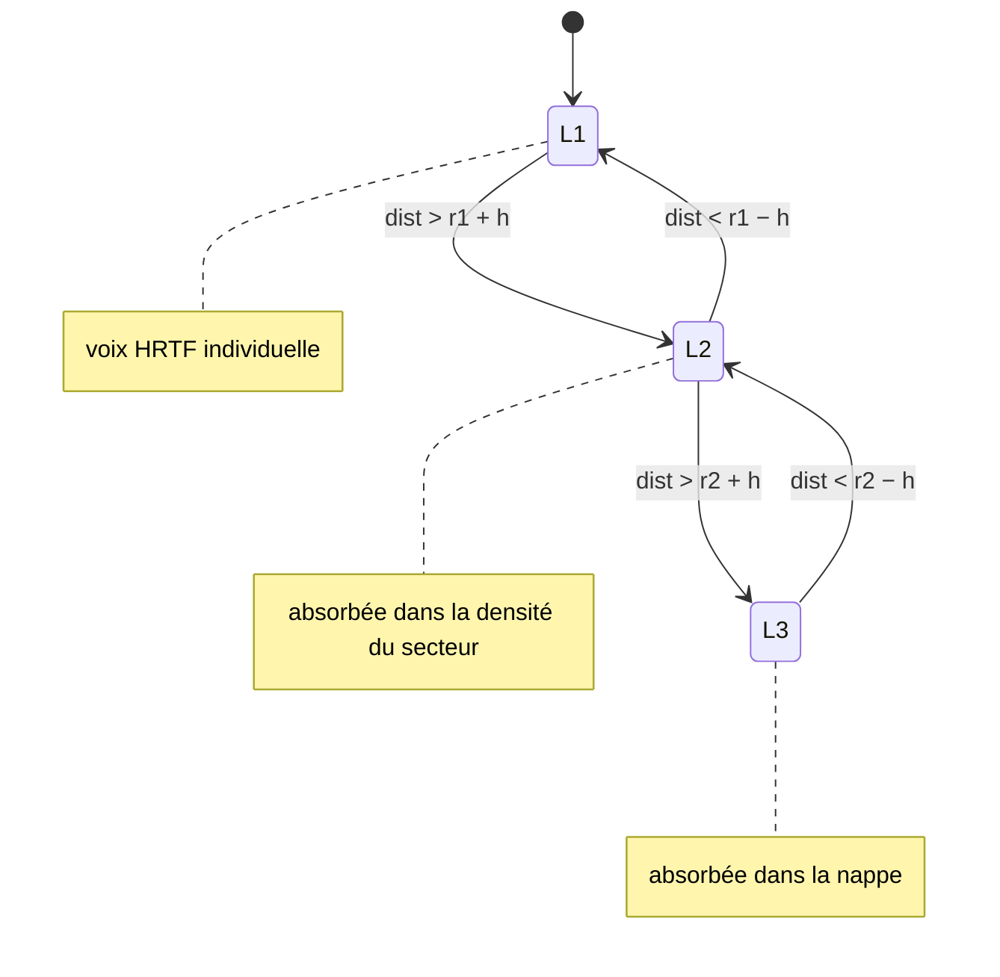
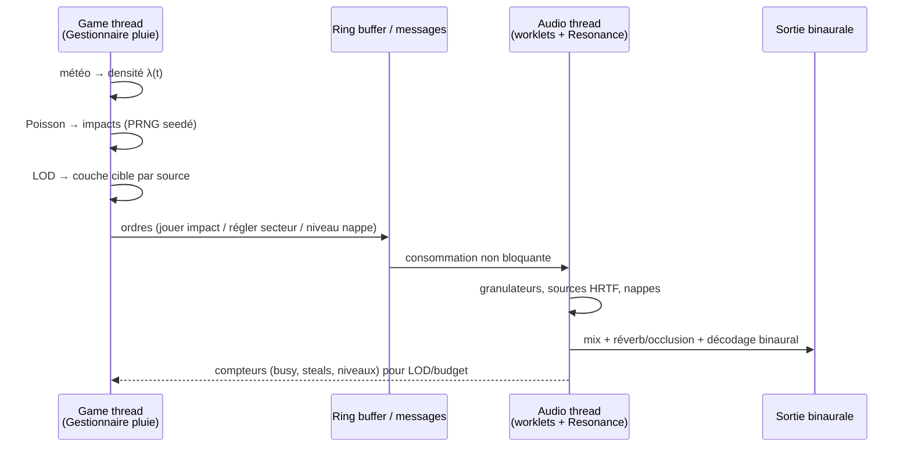
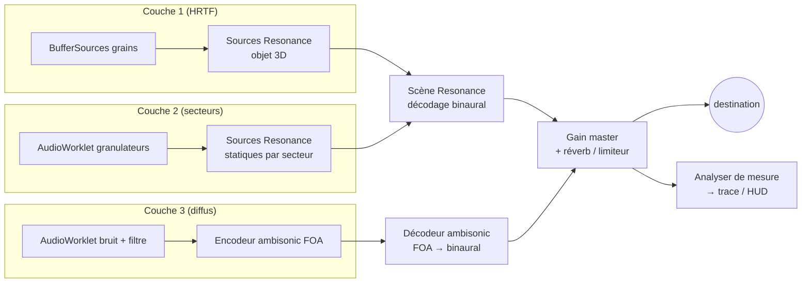
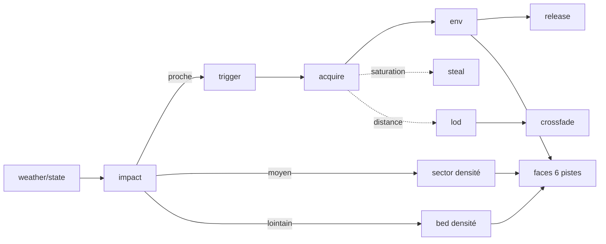
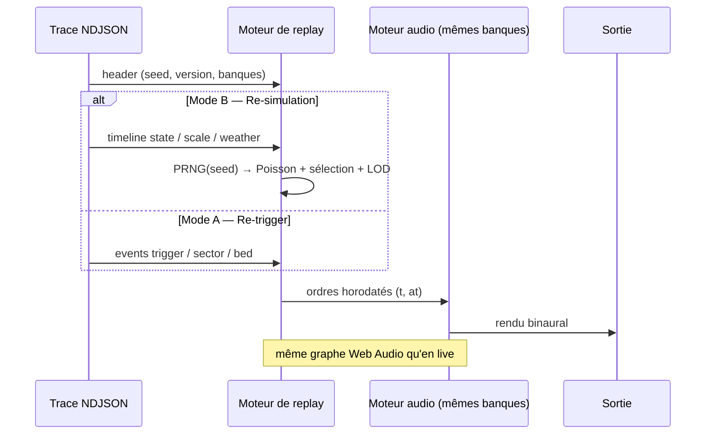

# Spécification — Moteur de son de pluie stratifié

> **Statut** : spécification *cible* (architecture finale) · ne décrit pas l'existant ni le chemin de migration.
> **Pile** : Resonance Audio + Web Audio API + AudioWorklet · sortie binaurale (casque/VR).
> **Principe** : exactitude **perceptuelle**, pas physique. Dépenser le budget là où l'oreille le remarque, tricher ailleurs.
> **Échelle** : un seul moteur, **paramétrable** du diorama de table (~4 m) au grand espace immersif (50 m+).
> **Observabilité** : tout est tracé (boîte noire) et **rejouable** (PRNG seedé).

---

## Sommaire

1. [Objectifs & invariants](#1-objectifs--invariants)
2. [Modèle du monde & repères](#2-modèle-du-monde--repères)
3. [Vue d'ensemble — la stratification](#3-vue-densemble--la-stratification)
4. [Le moteur d'échelle (world size configurable)](#4-le-moteur-déchelle-world-size-configurable)
5. [Couche 1 — Impacts « héros »](#5-couche-1--impacts-héros)
6. [Couche 2 — Texture moyenne](#6-couche-2--texture-moyenne)
7. [Couche 3 — Diffus lointain](#7-couche-3--diffus-lointain)
8. [Crossfades & LOD](#8-crossfades--lod)
9. [Orchestration & threads](#9-orchestration--threads)
10. [Pile audio & graphe Web Audio](#10-pile-audio--graphe-web-audio)
11. [Spatialisation par couche](#11-spatialisation-par-couche)
12. [Budgets & dimensionnement](#12-budgets--dimensionnement)
13. [Instrumentation — la boîte noire étendue](#13-instrumentation--la-boîte-noire-étendue)
14. [Replay déterministe](#14-replay-déterministe)
15. [Modèle de données](#15-modèle-de-données)
16. [Glossaire](#16-glossaire)

> **Ce document n'est PAS** : un plan de migration depuis le moteur actuel, ni un guide d'implémentation ligne à ligne, ni un benchmark. Il fige le **contrat** de la cible : structures, flux, événements, invariants.

---

## 1. Objectifs & invariants

### 1.1 Objectif

Simuler un environnement de pluie **perceptuellement crédible et localisable** sans simuler chaque goutte, à coût borné et profilable, sur navigateur (PWA).

### 1.2 Invariants (non négociables)

| # | Invariant | Conséquence de conception |
|---|---|---|
| **I1** | Exactitude **perceptuelle**, pas physique | On modélise l'irrégularité statistique (Poisson) et la différenciation par matériau, pas la trajectoire des gouttes. |
| **I2** | Budget de voix **fini et profilé** | Pool dimensionné par plateforme ; vol de voix par **priorité** ; LOD par distance. |
| **I3** | Échelle de monde **paramétrable** | Un seul moteur ; les frontières de couches dérivent d'une config (§4), pas de constantes en dur. |
| **I4** | Tout est **observable et rejouable** | Boîte noire (§13) conçue avec le moteur ; **PRNG seedé** ⇒ replay déterministe (§14). |
| **I5** | **Un seul repère monde**, conversions centralisées | Une unique fonction `monde → Resonance` ; le « piège du Z » vit à un seul endroit. |
| **I6** | Séparation **game thread / audio thread** | Décision (Poisson, sélection) ≠ rendu (worklets, Resonance) ; communication non bloquante. |
| **I7** | **Dégradation gracieuse** | Les couches se replient (§4) selon l'échelle et la plateforme, sans frontière audible (crossfades, §8). |

### 1.3 Ce que l'auditeur doit pouvoir percevoir

- **Direction** d'une averse (devant/derrière/gauche/droite, et — à terme — au-dessus).
- **Distance / enveloppement** : du tapotement proche distinct à la nappe diffuse lointaine.
- **Matériau frappé** (métal, bâche, terre, eau, bois…) — c'est là qu'on investit le HD.
- **Continuité** : aucune couture entre couches, aucune coupure de grain audible.
- **Réactivité** : déplacement de l'auditeur et météo modifient l'écoute en temps réel.

---

## 2. Modèle du monde & repères

### 2.1 Repère unique

Repère **main droite, Y-up**, partagé par le rendu visuel et l'audio :

- `+X` = droite · `+Y` = haut · `−Z` = avant (convention Resonance par défaut).
- L'auditeur a une **pose** : `position (x,y,z)` + `orientation (forward, up)`.
- Conversion `monde → Resonance` **centralisée** (invariant I5) : une seule fonction, identité par défaut, point de réparation unique si les repères divergent.

### 2.2 Les 6 faces d'écoute

Six directions cardinales de la tête servent de **points d'écoute** et de **pistes de trace** : `FRONT (−Z)`, `BACK (+Z)`, `DROIT (+X)`, `GAUCH (−X)`, `HAUT (+Y)`, `BAS (−Y)`.

> **Exigence verticale (corrige un défaut structurel connu)** : les sources NE doivent PAS être toutes sous l'auditeur. Les **points d'impact bakés** (§5.2) portent une **hauteur réelle** (relief), et la Couche 3 enveloppe en 3D. Sans cela, la face `HAUT` reste muette par construction.

### 2.3 Configuration de monde (`WorldConfig`)

```
WorldConfig {
  size:    mètres,            # côté (ou diamètre) du volume jouable
  preset:  'diorama' | 'room' | 'courtyard' | 'field' | 'custom',
  layers:  LayerConfig,       # frontières & budgets (cf. §4)
  weather: WeatherState,      # intensité pluie, vent (global, pilote la densité)
  seed:    entier             # graine du PRNG (replay déterministe, §14)
}
```

---

## 3. Vue d'ensemble — la stratification

Trois couches couvrant chacune une plage de distance et un rôle perceptuel, soudées par des **zones de crossfade**.

| Couche | Plage (réf.) | Méthode | Spatialisation | Coût |
|--------|--------------|---------|----------------|------|
| **1 — Impacts proches** | 0 – `r1` | Voix granulaires individuelles | HRTF / objet 3D (Resonance) | Élevé |
| **2 — Texture moyenne** | `r1` – `r2` | Granulaire dense **par secteurs** | Ambisonic / quadrants | Moyen |
| **3 — Diffus lointain** | `r2` – ∞ | Nappes de bruit filtré | Ambisonic / pré-mixé | Faible |



**Règle d'or** : une source vit dans **une couche à la fois**, sauf dans une zone de crossfade où elle est partagée par poids (§8). Le passage d'une couche à l'autre = **LOD** (§8.2).

---

## 4. Le moteur d'échelle (world size configurable)

L'enjeu : **le même moteur** doit servir un diorama de 4 m (où tout est « proche ») et un champ de 80 m (où les trois couches s'expriment pleinement). Les frontières `r1`, `r2` ne sont **jamais** des constantes : elles dérivent de `WorldConfig`.

### 4.1 Frontières dérivées

```
résoudreCouches(worldRadius, cfg):
    r1 ← min(cfg.L1.rMax, worldRadius)              # fin des impacts héros
    r2 ← min(cfg.L2.rMax, worldRadius)              # fin de la texture moyenne
    overlap ← cfg.crossfade × (r2 − r1)             # largeur de recouvrement
    retourne { r1, r2, overlap }
```

### 4.2 Repli des couches (collapse)

Quand le monde est trop petit pour qu'une couche existe, elle **se replie** dans la couche adjacente — sans couture (I7).



> **Cas diorama (~4 m)** : `worldRadius ≤ r1`. La Couche 2 est OFF ; la masse de pluie « lointaine » devient un **lit diffus Couche 3 mince** (enveloppement non localisé), pendant que les impacts proches portent la Couche 1. Ainsi le diorama garde de l'enveloppement **sans** dépenser une voix HRTF par goutte.

### 4.3 Préréglages d'échelle (`preset`)

Valeurs **indicatives** (à calibrer), en mètres :

| preset | size | `r1` | `r2` | crossfade | Couches actives |
|--------|------|------|------|-----------|-----------------|
| `diorama` | ~4 | 2,5 | — | 0,3 | 1 + 3 (mince) |
| `room` | ~12 | 4 | 10 | 0,25 | 1 + 2 + 3 (réduite) |
| `courtyard` | ~30 | 5 | 22 | 0,2 | 1 + 2 + 3 |
| `field` | ~80 | 6 | 35 | 0,15 | 1 + 2 + 3 (pleine) |

### 4.4 Exigence de continuité au changement d'échelle

Changer `preset`/`size` en cours de session **ne doit produire aucun artefact** : les frontières interpolent sur une courte rampe, les couches qui s'allument/s'éteignent crossfadent (§8). Tout changement émet un événement de trace `scale` (§13).

---

## 5. Couche 1 — Impacts « héros »

Porte la **crédibilité** : on entend la *surface frappée*, pas la goutte abstraite.

### 5.1 Déclenchement par processus de Poisson

Les impacts sont tirés statistiquement → irrégularité naturelle, jamais de motif mécanique.

```
# Taux instantané d'impacts (impacts/seconde) dans le champ proche
λ(t) = densitéPluie(t) × surfaceExposée × facteurMatériau

# Intervalle jusqu'au prochain impact (loi exponentielle)
prochainIntervalle(λ):
    u ← aléa()              # PRNG seedé, U(0,1) — reproductible (§14)
    retourne −ln(u) / λ
```

Chaque impact tiré choisit un **point d'impact baké** (§5.2) pondéré par l'exposition au ciel et la couverture matériau.

### 5.2 Points d'impact bakés

Pré-calcul hors temps réel sur la géométrie statique ; raycasts pour les objets mobiles.

```
PointImpact {
  position:    (x,y,z),     # hauteur RÉELLE (relief) → débloque la face HAUT
  normale:     (x,y,z),     # oriente le timbre / réflexion
  matériau:    id,          # → banque de samples
  expoCiel:    0..1         # proba d'être frappé (sous abri ⇒ ~0)
}
```

- **Bake** : échantillonne la surface, lance des rayons verticaux vers le ciel → `expoCiel`, stocke `normale` + `matériau`.
- **Runtime** : la sélection d'un impact tire dans l'ensemble baké, pondérée par `expoCiel × densité`.
- **Objets mobiles** : raycast ponctuel à la frappe (pas de bake possible).

### 5.3 Pool de voix à priorité

Budget fixe (§12). Chaque voix **possède** la position de son grain jusqu'à la fin (pas de repositionnement sous un grain en cours).

```
priorité(voix) = w_gain·gainNorm + w_dist·(1 − distNorm) + w_att·attention − w_age·âgeNorm
# attention : 1 si dans le champ de vision / focus, < 1 sinon (culling perceptuel)
```

```
jouerImpact(point, sample, params):
    si poolLibre:
        v ← prendreVoixLibre()
    sinon:
        v ← voixDePlusFaiblePriorité()      # vol par PRIORITÉ, pas par âge
        couperAvecFondu(v, 5 ms)            # fondu inaudible, jamais de clic
        tracer('steal', victime=v, ...)     # §13
    v.position ← point.position             # figée pour toute la vie du grain
    v.priorité ← priorité(v)
    démarrerGrain(v, sample, params)        # HRTF via source Resonance
    tracer('acquire', v, dur=sample.durée)  # §13
```

### 5.4 Banque de samples & anti-répétition

- **Banque par matériau** (eau, métal, bois, feuille, pierre, verre…), HD 48–96 kHz, **courts et secs** (réverb ajoutée dynamiquement), transitoires riches.
- **Anti-répétition** : round-robin par matériau + randomisation `pitch` (detune), `gain`, `filtre`. Le choix `(sample, detune, gain, filtre)` est **journalisé** ⇒ rejouable (§14).

### 5.5 LOD d'entrée

Un impact dont la distance dépasse `r1 − overlap` n'est **pas** instancié comme voix héros : il est absorbé par la **densité** de la Couche 2 (§6) ou le lit diffus (§7). Voir §8.

### 5.6 Instrumentation Couche 1

Émet : `impact` (cause racine), `trigger` (grain), `acquire`, `steal` (avec priorité & reste de durée), `release`, `env` (enveloppe par voix). Détail §13.

---

## 6. Couche 2 — Texture moyenne

Fait le **pont** entre les impacts distincts et la nappe globale. Granulaire **dense**, déclenché statistiquement mais **non positionné individuellement**.

### 6.1 Spatialisation par secteurs

Le plan horizontal autour de l'auditeur est divisé en `N` **secteurs** (ex. 8 quadrants). Un secteur = **un flux granulaire** continu, encodé dans la direction du secteur (ambisonic / panning).



### 6.2 Granulateur (AudioWorklet)

Chaque secteur porte un **granulateur** (AudioWorklet) : flux continu de grains courts piochés dans les banques matériau du secteur, à un débit piloté par la densité locale.

```
# Dans le worklet, par secteur :
paramètres(secteur):
    débit     ← densitéLocale(secteur)      # grains/s
    matériaux ← couvertureMatériau(secteur) # pondération des banques
    occlusion ← occlusionLocale(secteur)    # murs/abris → atténuation + filtrage passe-bas
boucleGrain():
    à chaque intervalle de Poisson(débit):
        g ← grain(matériaux, pitchAléa, gainAléa)
        appliquer(occlusion)
        émettre(g)
```

### 6.3 Modulation géométrique

Densité par secteur modulée par la **géométrie locale** : couverture matériau, occlusion (murs, abris), réflexions précoces en espace confiné.

### 6.4 Instrumentation Couche 2

Émet `sector` (~30 Hz) : `secteur`, `débit`, `level`, `occlusion`, `matMix`. Pas d'événement par grain (trop dense) — on trace l'**enveloppe agrégée** par secteur. Détail §13.

---

## 7. Couche 3 — Diffus lointain

La **masse globale**, non localisable, à coût quasi constant.

### 7.1 Nappes de bruit sculpté

```
NappeDiffuse {
  source: bruit (pink/brown) via AudioWorklet,
  filtre: passe-bande modulé par météo (intensité → ouverture/centre),
  encode: ambisonic ordre 1 (immersif, coût constant),
  niveau: f(intensitéPluie globale)
}
```

- **Génération** : AudioWorklet de bruit (pink/brown) → filtre → encodeur ambisonic ordre 1.
- **Pré-mixable** : les textures denses peuvent être *bakées* hors temps réel et lues comme soundfield.
- **Modulation** : pilotée par la **météo globale** (intensité, vent), pas par des impacts individuels.

### 7.2 Rôle au diorama

À l'échelle diorama (§4.2), la Couche 3 **mince** fournit l'enveloppement de fond (le « wash » de la pluie tout autour) que la Couche 1 seule ne peut pas donner.

### 7.3 Instrumentation Couche 3

Émet `bed` (au changement) : `niveau`, `filtre{centre,largeur}`, `ordre`, déclencheur météo. Détail §13.

---

## 8. Crossfades & LOD

### 8.1 Crossfade entre couches

Dans la zone de recouvrement `[r − overlap, r]`, une source contribue **partiellement** aux deux couches, en **gain à puissance constante** :

```
# poids d'appartenance à la couche supérieure, t ∈ [0,1] dans la zone
fondu(t):
    g_haut ← sin(t · π/2)
    g_bas  ← cos(t · π/2)        # g_haut² + g_bas² = 1 (puissance constante)
    retourne (g_bas, g_haut)
```

### 8.2 LOD par distance (promotion / démotion)

Une source migre de couche selon sa distance à l'auditeur, avec **hystérésis** pour éviter le papillonnement aux frontières.



- `h` = marge d'hystérésis.
- **Démotion** L1→L2 : la voix héros est relâchée (fondu), son énergie repart dans la densité du secteur correspondant.
- **Promotion** L2→L1 : un impact proche redevient une voix héros (si budget disponible, sinon reste en densité).

### 8.3 Gestion de budget

Le LOD est aussi un **levier de budget** (I2) : sous pression (pool saturé, plateforme faible), on **abaisse** `r1` → moins de voix héros, plus de densité/nappe. Tout ajustement émet `lod` / `budget` (§13).

---

## 9. Orchestration & threads

⚠️ **Séparation des threads** (I6) : le **déclenchement** (game thread : Poisson, sélection, météo, LOD) est distinct du **rendu** (audio thread : worklets, Resonance). Communication par messages / ring buffer **non bloquante**.



> **Note PWA** : l'audio thread = `AudioWorkletProcessor` (Couches 2/3) + le pipeline Resonance (Couche 1). Le game thread = boucle applicative (requestAnimationFrame / worker). Aucun calcul lourd ne bloque le rendu audio.

---

## 10. Pile audio & graphe Web Audio

### 10.1 Répartition des responsabilités

| Brique | Rôle |
|--------|------|
| **Resonance Audio** | Spatialisation **objet/HRTF** (Couche 1) + sources statiques de secteurs (Couche 2) ; décodage binaural. |
| **AudioWorklet** | Synthèse : **granulateurs** (Couche 2), **bruit filtré** (Couche 3). |
| **Web Audio (nœuds standard)** | BufferSources des grains héros, gains, filtres, crossfades, bus, master. |

### 10.2 Graphe (recommandé)



> **Alternative** (à évaluer, §16) : router aussi la Couche 3 dans une source « soundfield » de Resonance plutôt qu'un décodeur ambisonic séparé, pour un seul décodage binaural. Compromis : simplicité vs contrôle de l'ordre ambisonic.

### 10.3 Mesure

Un **tap analyser** sur le master fournit le niveau **réel post-spatialisation** (ce qu'on entend) à la trace (§13) et au HUD — distinct des mesures par voix (en amont du pipeline).

---

## 11. Spatialisation par couche

| Couche | Technique | Pourquoi |
|--------|-----------|----------|
| **1** | **HRTF binaural** complet, par source objet | Localisation fine des impacts proches (l'oreille y est sensible). |
| **2** | **Ambisonic** / panning par secteur | Enveloppement à coût modéré sans N sources ponctuelles. |
| **3** | **Ambisonic ordre 1** | Diffus immersif **non localisable** à coût quasi constant. |

- **Pose de l'auditeur** : `position` suit la tête (input de référence). `orientation` posée explicitement — **et tracée** (§13) — pour qu'une rotation future de la tête (distincte de l'orbite caméra) pilote le champ. L'orbite caméra (vue) reste **découplée** de l'écoute par défaut.
- **Projection 6 faces** : niveau de chaque face = somme pondérée des sources actives projetées sur la normale de la face. Sert au HUD live et à la trace (6 pistes).
- **Occlusion & réflexions** : surfaces couvertes coupent la Couche 1, atténuent la 3 ; réflexions précoces géométriques en zones confinées (Couche 2).

---

## 12. Budgets & dimensionnement

### 12.1 Formule de concurrence (Couche 1)

```
voixSimultanées ≈ débitImpacts(λ) × duréeMoyenneGrain
budgetVoix      ≥ pic(voixSimultanées) × margeSécurité
```

### 12.2 Préréglages par plateforme

Valeurs **indicatives** (à profiler tôt — I2) :

| Plateforme | Voix L1 (HRTF) | Secteurs L2 | Ordre ambisonic L3 | Sample rate |
|------------|----------------|-------------|--------------------|-------------|
| **Mobile** | 12–16 | 4 | 1 | 48 kHz |
| **Desktop** | 32–48 | 8 | 1–2 | 48 kHz |
| **VR / casque** | 48+ | 8–12 | 2–3 | 48–96 kHz |

### 12.3 Leviers d'optimisation

| Levier | Bénéfice |
|--------|----------|
| LOD audio par distance (§8) | Réduit la granularité loin de l'auditeur. |
| Vol de voix par **priorité** (§5.3) | Réutilise intelligemment les voix saturées. |
| Culling par attention / champ de vision | Concentre le budget où l'oreille écoute. |
| Pré-mixage des grains lointains (§7) | Bake des textures denses hors temps réel. |
| Round-robin + randomisation (§5.4) | Réalisme sans coût CPU. |
| Ambisonic pour le diffus (§7) | Coût constant vs N sources ponctuelles. |
| **Coupe des grains négligeables** | Libère une voix dès qu'un grain passe sous un seuil dB audible. |

---

## 13. Instrumentation — la boîte noire étendue

> **Principe** : conçue *avec* le moteur (I4), pas après. Journal **structuré** (pas un enregistrement audio) : chaque son est traçable de sa **cause** (impact / météo) à son **rendu** (enveloppe, position, 6 faces). Export **NDJSON** (un objet JSON par ligne, `grep`-able). Coût quasi nul hors enregistrement.

### 13.1 Principes conservés

- **Causalité** : chaque impact porte un `impact` id ; tout ce qui en découle le référence. Chaque grain porte un `grain` id.
- **Double horloge** : `t` (game thread, ms) + `at` (audio thread, s) ⇒ déboguer les décalages physique↔son.
- **État en delta** : `state` n'émet que les champs changés, avec une version `sv`.
- **Anneau pré-alloué** : écriture O(1) ; `truncated` si l'anneau a tourné.

### 13.2 Schéma d'événements (cible)

Événements **existants** (Couche 1, conservés) :

| `type` | Émis quand | Champs clés |
|--------|------------|-------------|
| `session` | démarrage/arrêt | `event` |
| `header` | 1re ligne du fichier | `format`, `meta`, `seed`, `count`, `truncated` |
| `state` | un paramètre monde change | `patch`, `sv` |
| `impact` | une goutte franchit le sol (**cause racine**) | `impact`, `surface`, `x/y/z`, `expoCiel` |
| `reject` | un impact ne sonne pas | `impact`, `surface`, `reason` |
| `trigger` | un grain héros est déclenché | `impact`, `grain`, `surface`, `x/y/z`, `gainDb`, `detune`, `sample`, `dur` |
| `acquire` | une voix est affectée | `grain`, `voice`, `mat`, `prio`, `dur` |
| `steal` | une voix volée (priorité) | `grain`, `victim{voice,grain,age,dur,remaining}`, `reason`, `fade` |
| `release` | un grain finit | `grain`, `voice`, `reason` |
| `env` | enveloppe par voix (~30 Hz) | `grain`, `voice`, `db`, `x/y/z`, `weak?` |
| `faces` | 6 pistes (~30 Hz) | `labels`, `db[6]`, `head{x,y,z,fwd,up}`, `busy`, `size`, `steals` |

Événements **nouveaux** (Couches 2/3, échelle, LOD — *conçus ici*) :

| `type` | Couche | Émis quand | Champs clés |
|--------|--------|------------|-------------|
| `scale` | — | changement d'échelle/preset | `preset`, `size`, `r1`, `r2`, `overlap` |
| `sector` | 2 | enveloppe agrégée par secteur (~30 Hz) | `sector`, `débit`, `level`, `occlusion`, `matMix` |
| `bed` | 3 | la nappe change | `niveau`, `filtre{centre,largeur}`, `ordre`, `weatherSv` |
| `crossfade` | 1↔2↔3 | une source franchit une zone de fondu | `grain?`, `from`, `to`, `g_bas`, `g_haut` |
| `lod` | 1↔2↔3 | promotion/démotion d'une source | `grain?`, `from`, `to`, `dist`, `reason` |
| `budget` | — | pression budget / ajustement (~1 Hz) | `busyL1`, `sizeL1`, `steals`, `sectorsActive`, `r1Adj` |

### 13.3 Chaîne causale étendue



### 13.4 Requêtes types (NDJSON / jq)

```
# Coupures audibles : grains volés AVANT leur fin
jq 'select(.type=="steal" and .victim.remaining > 0)' trace.ndjson

# La face HAUT reçoit-elle enfin de l'énergie ?
jq -r 'select(.type=="faces") | .db[4]' trace.ndjson | grep -v null | wc -l

# Voix gaspillées par des grains négligeables
jq 'select(.type=="env" and .weak==true)' trace.ndjson | wc -l

# Vie d'un secteur (débit/niveau au fil du temps)
jq -r 'select(.type=="sector" and .sector==3)|[.t,.débit,.level]|@tsv' trace.ndjson
```

---

## 14. Replay déterministe

> **But** : **ré-entendre** une session sans avoir enregistré d'audio, à partir de la seule trace. Indispensable au débogage perceptuel et aux tests de non-régression.

### 14.1 Condition de déterminisme : PRNG seedé (I4)

Tout aléa du moteur passe par **un PRNG seedé** (jamais `Math.random` brut) : Poisson, choix de sample, detune, gain/filtre aléatoires, jitter de secteur. La graine `seed` est journalisée dans le `header`.

```
PRNG(seed):                 # ex. générateur à état explicite, reproductible
  état ← seed
  aléa():
    état ← mélange(état)    # transition déterministe
    retourne normaliser(état) ∈ [0,1)
```

### 14.2 Deux modes de replay

| Mode | Entrée | Reconstruit | Usage |
|------|--------|-------------|-------|
| **A — Re-trigger** | les événements `trigger`/`sector`/`bed` de la trace | re-synthèse en rejouant les ordres tels quels | rejeu fidèle d'une session, même sans la graine |
| **B — Re-simulation** | `header.seed` + timeline `state`/`scale`/`weather` | re-déroule Poisson + sélection + LOD **à l'identique** | tester une variante du moteur sur la même entrée |

### 14.3 Ce que la trace doit capturer pour le replay

- **Graine** `seed` + version du moteur (`header.meta`).
- **Timeline d'état** complète en deltas (`state`, `scale`, météo) — l'entrée du game thread.
- **Paramètres reproductibles** par grain (`sample`, `detune`, `gainDb`) — déjà dans `trigger`.
- **Banques de samples** référencées par id/version (le replay rejoue les mêmes fichiers).

### 14.4 Flux de replay



### 14.5 Limites assumées

Le rendu Web Audio n'est pas **échantillon-exact** d'une machine à l'autre (horloge audio, HRTF). Le déterminisme porte sur le **flux d'événements** et le **résultat perceptuel**, pas sur le bit-à-bit du signal. Toute divergence d'événements entre live et replay = régression à investiguer.

---

## 15. Modèle de données

### 15.1 Terrain (donnée éditable)

```
Terrain {
  matériau: grille fine (cellule ~0,5 m) → id matériau,
  relief:   grille blocs (~1 m)         → hauteur,
  requête:  (x,z) → { matériau, hauteur }   # O(1) par quantification
}
```

### 15.2 Points d'impact bakés

```
BakedSet {
  points: [ PointImpact ],        # cf. §5.2
  index:  spatial (grille/BVH)    # sélection pondérée rapide par zone
}
```

### 15.3 Banque de matériau

```
MaterialBank {
  id, label,
  samples: [ AudioBuffer ],       # courts, secs, HD
  minDistance, maxDistance,       # atténuation (mètres → unités via repère)
  rolloff: 'logarithmic'
}
```

### 15.4 Config de couches

```
LayerConfig {
  L1: { rMax, voices, priorité{w_gain,w_dist,w_att,w_age}, seuilWeakDb },
  L2: { rMax, sectors, débitMax },
  L3: { ordre, filtre },
  crossfade: fraction,            # largeur de recouvrement (0..1)
  hystérésis: mètres
}
```

---

## 16. Glossaire

| Terme | Sens |
|-------|------|
| **Grain** | Un son court (sample de goutte) joué par une voix de Couche 1. |
| **Voix (voice)** | Canal de lecture spatialisé du pool (budget fini). |
| **Voice stealing** | Réaffectation d'une voix occupée, ici par **priorité** (gain×dist×attention). |
| **Poisson** | Processus statistique d'arrivées → irrégularité naturelle des impacts. |
| **Secteur** | Quadrant directionnel de la Couche 2 portant un flux granulaire. |
| **Nappe** | Texture diffuse continue (bruit filtré) de la Couche 3. |
| **HRTF** | Fonction de transfert de tête → spatialisation binaurale fine. |
| **Ambisonic** | Représentation du champ sonore par harmoniques sphériques (diffus à coût constant). |
| **LOD audio** | Niveau de détail variable selon la distance (couche 1→2→3). |
| **Crossfade** | Fondu à puissance constante entre couches (pas de couture audible). |
| **Bake** | Pré-calcul hors temps réel (points d'impact, textures denses). |
| **Boîte noire** | Journal causal NDJSON rejouable (instrumentation, §13). |
| **PRNG seedé** | Générateur pseudo-aléatoire reproductible (replay déterministe, §14). |
| **Collapse / repli** | Fusion de couches quand l'échelle du monde est trop petite (§4.2). |

---

### Points ouverts (à trancher avant implémentation)

1. **Décodage Couche 3** : décodeur ambisonic séparé vs source « soundfield » Resonance (§10.2) — un seul décodage binaural est-il préférable au contrôle d'ordre ?
2. **Granularité de `sector`** : 8 secteurs suffisent-ils, ou faut-il une résolution variable selon l'échelle (4 au diorama, 12 en grand monde) ?
3. **Coût des points bakés** : budget mémoire/temps de bake acceptable pour les grands mondes ?
4. **Hystérésis LOD** : valeur de `h` évitant le papillonnement sans latence perçue au déplacement.
5. **Banques HD** : nombre de variations par matériau pour que le round-robin ne s'entende pas.
