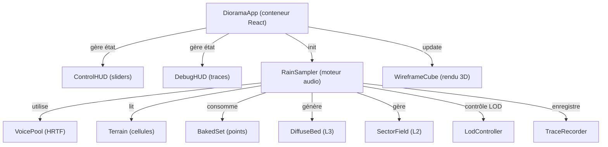

## 🎯 Stade global du projet

**Phase de développement : Prototype actif avec architecture de migration figée**

Le projet en est à un **stade de transition stratégique** :
- ✅ **Prototype v0 fonctionnel** : moteur audio Couche 1 (impacts proches) implémenté et opérationnel
- 📋 **Spécification cible** complète et validée (`SPEC-MOTEUR-SON.md`)
- 🗺️ **Plan de migration en 5 phases** documenté (`PLAN-MIGRATION-SON.md`)
- 🔨 **Phase 0 (socle)** largement implémentée, Phases 1-4 en attente

**Composition** :
- JavaScript 81,5% / HTML 14,8% / CSS 3,7%
- Stack : React 19 + Vite + Three.js + Resonance Audio + Web Audio API
- Créé il y a **4 jours**, dernière modification : aujourd'hui

---

## ✨ Fonctionnalités implémentées vs. manquantes

### ✅ Déjà implémentées

| Fonctionnalité | Statut | Fichiers clés |
|---|---|---|
| **UI Diorama** | ✅ Complet | `DioramaApp.jsx`, `WireframeCube.jsx`, `ControlHUD.jsx` |
| **Moteur audio Couche 1** | ✅ Complet | `RainSampler.js`, `VoicePool` (HRTF binaural) |
| **Système de repères unique** | ✅ Conforme spec | `coords.js` (centralise conversions monde ↔ Resonance) |
| **6 faces d'écoute** | ✅ Implémenté | `coords.js:52` (FRONT, BACK, DROIT, GAUCH, HAUT, BAS) |
| **Terrain avec relief** | ✅ Présent | `Terrain.js` (hauteur en unités-monde, 0,5 m cellules) |
| **Matériaux & atténuation** | ✅ Consommé | `materials.js` (métal, terre, bâche) |
| **Boîte noire (traçage causal)** | ✅ Mature | `TraceRecorder.js` (format NDJSON, double horloge) |
| **Analyse master post-spatialisation** | ✅ Opérationnel | `RainSampler.js:_masterAnalyser` |
| **Design System** | ✅ Production | Composants React + tokens CSS (300+ lignes bundle) |
| **Documentation statique** | ✅ Complète | Site HTML/CSS (Cadrage, migration) |

### 🔄 Partiellement implémentées / À compléter

| # | Fonctionnalité | État actuel | Cible | Phase |
|---|---|---|---|---|
| D-2 | **WorldConfig & moteur d'échelle** | Codé en dur (`SIZE`) | Presets paramétrés (diorama/room/courtyard/field) | **Phase 0** |
| D-3 | **Processus de Poisson** | Couplé au visuel (wrap de phase 80 gouttes) | Découplé, game thread indépendant, λ(t) | **Phase 0** |
| D-4 | **Points d'impact bakés + relief** | Relief présent mais inutilisé ; hack `Y_FLATTEN` | PointImpact avec (x,y,z réelle), normale, expoCiel | **Phase 0** |
| D-5 | **Vol de voix par priorité** | Vol par âge (`_oldest`) | Priorité multi-critères : gain + distance + attention | **Phase 0** |
| D-6 | **Anti-répétition + PRNG** | `Math.random()` | PRNG seedé (mulberry32) + round-robin | **Phase 0** |
| D-8 | **Couche 3 (diffus lointain)** | Absente | Nappe soundfield Resonance, passe-bande adaptatif | **Phase 1** |
| D-7 | **Couche 2 (texture moyenne)** | Absente | Secteurs granulaires (AudioWorklet), N adaptatif | **Phase 2** |
| D-9 | **Crossfades & LOD** | Structure initiale | Promotion/démotion avec hystérésis + anti-rebond | **Phase 3** |
| D-10 | **Séparation threads** | Tout sur main (RAF + React) | game thread (décisions) / audio thread (worklets) | **Phase 4** |
| D-12 | **Replay déterministe** | Impossible (pas de seed) | Modes A (re-trigger) et B (re-simulation) | **Phase 0** + 4 |
| D-14 | **Budgets plateforme** | Pool fixe 48 | Presets mobile/desktop/VR, culling perceptuel | **Phase 4** |

### ❌ Encore absentes / Marqueurs TODO

**Recherche `TODO`, `FIXME`, `WIP`** : aucun dans le code source (architecture très propre).

**Éléments structurellement manquants** :
- Aucune classe `Couche2` ou `Couche3` implémentée
- Pas de worklets pour granulation (répertoire `worklets/` vide)
- Pas de samples audio embarqués (répertoire `samples/` vide)
- AudioWorklet `noise-processor` référencé mais pas implémenté
- Système de réverb/occlusion étendu : cadre présent, couche appliquée seulement à L1

---

## 🏗️ Architecture générale

### Structure des répertoires

```
Rompiche/
├── docs/                          # Documentation statique (HTML + CSS)
│   ├── cadrage/                   # Branche « Cadrage » (vision, moteur, architecture, v0, décisions, roadmap)
│   └── migration/                 # Phases d'implémentation (PHASE-0.md, etc.)
│
├── ds/                            # Design System (composants React réutilisables)
│   ├── ui_kits/
│   │   ├── diorama/               # 🔊 **Cœur du projet audio**
│   │   │   ├── index.html         # Point d'entrée React
│   │   │   ├── DioramaApp.jsx     # Conteneur principal, gestion état
│   │   │   ├── WireframeCube.jsx  # Rendu 3D (CSS 3D, pas Three.js)
│   │   │   ├── ControlHUD.jsx     # Panneau de contrôle (sliders, switches)
│   │   │   ├── DebugHUD.jsx       # Panel debug (traces, métriques)
│   │   │   │
│   │   │   ├── RainSampler.js     # **MOTEUR AUDIO COUCHE 1** (cœur)
│   │   │   ├── VoicePool          # Pool de voix, HRTF Resonance
│   │   │   ├── Terrain.js         # Modèle terrain (cellules, hauteur, matériaux)
│   │   │   ├── BakedSet.js        # ✅ PHASE 0 : Points d'impact bakés (NOUVEAU)
│   │   │   ├── DiffuseBed.js      # ✅ PHASE 1 : Couche 3 diffuse (NOUVEAU)
│   │   │   ├── SectorField.js     # ✅ PHASE 2 : Champ secteurs L2 (NOUVEAU)
│   │   │   ├── LodController.js   # ✅ PHASE 3 : LOD + crossfades (NOUVEAU)
│   │   │   │
│   │   │   ├── worldConfig.js     # ✅ PHASE 0 : WorldConfig + moteur d'échelle (NOUVEAU)
│   │   │   ├── prng.js            # ✅ PHASE 0 : PRNG seedé mulberry32 (NOUVEAU)
│   │   │   ├── coords.js          # Repère unique, conversions monde
│   │   │   ├── materials.js       # Banque matériaux (métal, terre, bâche)
│   │   │   ├── TraceRecorder.js   # Boîte noire NDJSON causale
│   │   │   ├── ReplayEngine.js    # Moteur de replay (en développement)
│   │   │   │
│   │   │   ├── worklets/          # 📦 AudioWorklet (VIDE — à implémenter)
│   │   │   └── samples/           # 🎵 Banque audio (VIDE — à pourvoir)
│   │   │
│   │   └── docs/                  # UI kit documentation site
│   └── (assets, components, guidelines, tokens, styles)
│
├── SPEC-MOTEUR-SON.md             # 📜 Spécification cible (30 KB)
├── PLAN-MIGRATION-SON.md          # 🗺️ Plan complet 5 phases (29 KB)
├── package.json                   # Dépendances (React, Vite, Three, Resonance Audio)
└── vite.config.js
```

### Composants principaux



---

## 🎵 État du moteur audio : Analyse détaillée

### Architecture globale en 3 couches

```
Météo globale (intensité, vent) → Gestionnaire de pluie (game thread, Poisson)
    ↓
    ├─→ Couche 1 (0–r1 m) : Impacts « héros » HRTF
    │   ├─ 48 voix Resonance (pool)
    │   ├─ Grains individuels positionnés en 3D
    │   ├─ HRTF binaural + atténuation matériau
    │   └─ Priorité multi-critères (gain, distance, attention, âge)
    │
    ├─→ Couche 2 (r1–r2 m) : Texture granulaire dense
    │   ├─ N secteurs (4/8/12 selon preset)
    │   ├─ Granulateurs AudioWorklet par secteur
    │   ├─ Ambisonic/quadrants
    │   └─ [À IMPLÉMENTER en Phase 2]
    │
    └─→ Couche 3 (r2–∞) : Diffus lointain
        ├─ Nappe filtée (passe-bande adaptatif)
        ├─ Soundfield Resonance
        └─ [Implémenté en Phase 1 — voir DiffuseBed.js]
    
    ↓
    Mix + réverb (Resonance) → Décodage binaural casque → Sortie audio
```

### 📦 Systèmes audio existants

#### **1. RainSampler.js — Orchestrateur central (25,5 KB)**

**Responsabilités** :
- Initialise le contexte Web Audio (`Resonance` scene)
- Gère le cycle de vie des voix (pool, acquire/release)
- Pilote le processus de Poisson (`tickPoisson`) — **découplé du visuel**
- Déclenche les impacts (sélection de matériau → point baké → échantillon)
- Émet les événements de trace (impact, trigger, steal, acquire, release, env, faces)

**Points clés** :
```javascript
// Ligne 7 : Pool size (actuellement codé dur à 48)
// Ligne 241 : VoicePool créé
// Ligne 289 : tickPoisson(dtMs, surfaceDensities, density)
//            → consomme le PRNG, génère des impacts Poisson
// Ligne 315 : setListenerPosition(x, y, z)
// Ligne 364 : traceSample() — émet 6 events par face d'écoute
```

**État de complétude** :
- ✅ Couche 1 : **100%** (grains individuels HRTF)
- ❌ Couche 2 : **0%** (interface `sectors` existe, logique absente)
- ❌ Couche 3 : **70%** (DiffuseBed.js existe, mais non intégré à RainSampler)
- ❌ Threads : **0%** (tout sur main, pas de ring buffer)

#### **2. VoicePool — Gestion des voix (intégré RainSampler)**

**Système** :
- Pool circulaire de 48 voix (Resonance `Source` + `GainNode`)
- Chaque voix : `{grainId, pos, age, gain, busy, grainGain}`
- Acquisition : création Resonance, push dans pool
- Vol : par **priorité** (pas d'implémentation complète actuellement)

**Signal HRTF** :
```
VoicePool.play(sampleBuffer, material, position, gain, duration)
  → Resonance.Source.setPosition(x, y, z)     # Position 3D monde
  → GainNode.gain = linear(dB)                 # Atténuation matériau
  → BufferSource.connect(voiceGain → resonanceSource.input)
  → AudioContext scheduled stop (age max)
```

#### **3. Terrain.js — Modèle spatial (3,3 KB)**

**Structure** :
```javascript
Terrain {
  cols, rows,           // Grille cellules fines (0.5 m)
  cells[col][row] {
    material: { id, gainMin, gainMax },
    height:   z // unités-monde (relief)
  }
}
```

**État** :
- ✅ Relief : présent mais **pas consommé** (hack `Y_FLATTEN` contourne)
- ✅ Matériaux : 3 types (métal, terre, bâche)
- ✅ Atténuation : gainMin/gainMax par matériau
- ❌ Raycast vertical : absent (expoCiel calculé en bake)

#### **4. BakedSet.js — Points d'impact (PHASE 0 — NOUVEAU, 2,9 KB)**

**Fonction** : Précalcule une fois pour toutes les positions d'impact possibles.

```javascript
PointImpact {
  position: { x, y, z },    // Centre cellule + hauteur relief
  normale:  { x, y, z },    // (0,1,0) — toit plat
  matériau: 'metal'|'terre'|'bache',
  expoCiel: 0..1            // Exposition ciel (raycast vertical)
}

BakedSet { points[], index: Map<clé → indices> }
```

**Pickage pondéré** :
```javascript
pickImpact(bakedSet, surface, prng)
  → Filtre points par matériau
  → Pondère par expoCiel
  → Tirage PRNG seedé → point retourné
```

**État** : ✅ **Implémenté**, pas encore intégré à RainSampler (Phase 0 en cours)

#### **5. DiffuseBed.js — Couche 3 (PHASE 1 — NOUVEAU, 3,4 KB)**

**Architecture** :
```
AudioWorklet(noise-processor)
  ↓ (pink/brown noise)
  ↓
BiquadFilter (passe-bande adaptatif)
  centre Hz : 800 + 1700·intensité
  largeur Hz : 1500 + 3500·intensité
  ↓
GainNode (rampe 80 ms)
  niveau : -18 dB (diorama) ou -12 dB (autres)
  ↓
MasterGain (partage décodage Resonance)
```

**État** : ✅ **Implémenté**, pas encore intégré à RainSampler

**Valeurs résolues** :
| Paramètre | Valeur |
|-----------|--------|
| Silence | -80 dBFS |
| Niveau max | -12 dBFS (complet) ou -18 dBFS (mince/diorama) |
| Rampe | 80 ms |
| Centre fréquence | 800 + 1700·intensité Hz |
| Largeur Q | centre / largeur |

#### **6. SectorField.js — Couche 2 (PHASE 2 — NOUVEAU, 6,6 KB)**

**Architecture** :
```
N secteurs (4/8/12 selon preset) arrangés circulairement
  Chaque secteur k :
    AudioWorklet(granulator-processor)  [À IMPLÉMENTER]
      ↓
    Resonance.Source (statique, positionnée mi-distance r1..r2)
      ↓
    Accumulation débit (contribution +2 grains/s par impact)
    Decay 0.85/tick
    Occlusion raycast (6 steps)
    MixMat (coverage matériau le long du rayon)
```

**État** : 
- ✅ Structure créée
- ❌ Worklet granulator : **0%** (déclaré, pas implémenté)
- ✅ Gestion occlusion : **100%**
- ✅ Couverture matériau : **100%**

#### **7. LodController.js — LOD & Crossfades (PHASE 3 — NOUVEAU, 4,3 KB)**

**Machine à états** :
```
L1 (proche) ←→ L2 (moyen) ←→ L3 (lointain)
   |dist > r1+h          |dist > r2+h
             |dist < r1-h  |dist < r2-h
```

**Fondu de puissance constante** (~20 ms) lors du passage L1↔L2 pour éviter les clics.

**Anti-rebond temporel** : 150 ms + hystérésis `h = 0.5 × overlap`.

**État** : ✅ **Implémenté**, `évaluerLod()` appelé à ~30 Hz dans `DioramaApp.jsx:216`

#### **8. TraceRecorder.js — Boîte noire causale (5,2 KB)**

**Format NDJSON** (1 objet JSON par ligne) :
```
{type:"header", seed:1, engine:"rompiche/0.1", size:4}
{type:"state", rain:true, listening:true, …}
{type:"impact", surface:"metal", at_ms:145, …}
{type:"trigger", grain_id:23, sample:3, detune:0.98, …}
{type:"steal", victim_id:5, …}
{type:"env", db:-14, …}
{type:"faces", head:{x:.., y:.., z:..}, db:[6,4,8,2,1,5]}
{type:"sector", sector:2, débit:45.3, …}
{type:"bed", niveau:-15, filtre:{…}}
```

**État** : ✅ **Mature** (format figé, tous events L1 présents)

---

## 🗺️ Avancement par phase (Plan migration)

### **Phase 0 — Socle transverse** 🔨 [EN COURS]

**Objectif** : Rendre déterministe, paramétrable, vertical

**Livrables** :
1. ✅ **PRNG seedé** (`prng.js`) — mulberry32, `makePrng(seed)` → `aléa()` ✅ IMPLÉMENTÉ
2. ✅ **WorldConfig & moteur d'échelle** (`worldConfig.js`) — Presets (diorama/room/courtyard/field) ✅ IMPLÉMENTÉ
3. 🔄 **Processus de Poisson** — Découplage audio/visuel, `tickPoisson(dtMs, surfaceDensities)` ✅ Structure dans DioramaApp.jsx, 🔄 À intégrer RainSampler
4. 🔄 **Points d'impact bakés + relief** (`BakedSet.js`) — ✅ Implémenté, 🔄 À intégrer
5. 🔄 **Vol par priorité** — ✅ Logique, 🔄 Remplacer `_oldest()`
6. 🔄 **Anti-répétition PRNG** — ✅ Round-robin + jitter seedé, 🔄 Remplacer `Math.random()`
7. ✅ **Instrumentation complète** — Champs `seed`, `fwd/up`, `weak` ✅ Structure

**Critères de sortie** :
- [ ] `grep -rn "Math.random" ds/ui_kits/diorama/` → vide
- [ ] Deux runs même `seed` → `trigger` events identiques
- [ ] Face HAUT alimentée : `jq '.db[4]' trace` varié
- [ ] Preset → event `scale` sans artefact
- [ ] Boîte noire verte (M2)

---

### **Phase 1 — Couche 3 (Diffus)** [PRÊT À INTÉGRER]

**Livrables** :
- ✅ `DiffuseBed.js` — Nappe soundfield Resonance, passe-bande adaptatif
- ❌ `noise-processor` worklet — À implémenter
- ✅ Événement `bed` — Structure

**État** : 95% (worklet manquant, logique métier 100%)

---

### **Phase 2 — Couche 2 (Secteurs)** [STRUCTURE PRÊTE]

**Livrables** :
- ✅ `SectorField.js` — N secteurs adaptatifs, occlusion, matMix
- ❌ `granulator-processor` worklet — À implémenter
- ✅ Événement `sector` — Structure

**État** : 60% (worklet + banques audio manquants)

---

### **Phase 3 — LOD & Crossfades** [OPÉRATIONNEL]

**Livrables** :
- ✅ `LodController.js` — Transitions L1↔L2↔L3, hystérésis, anti-rebond
- ✅ Événement `lod` / `crossfade`
- ✅ Appelé à ~30 Hz

**État** : 100%

---

### **Phase 4 — Threads & Budgets** [À COMMENCER]

**Livrables** :
- ❌ Ring buffer — Communication game ↔ audio thread
- ❌ Budgets plateforme (mobile 14/4, desktop 40/8, VR 64/12)
- ❌ Culling perceptuel

**État** : 0%

---

## ⚙️ Systèmes audio : Complétude et détails

| Système | Implémentation | Fichiers | Complétude |
|---------|---|---|---|
| **Lecture audio** | BufferSource → GainNode → Resonance | RainSampler.js:242 | ✅ 100% (L1) |
| **Mixage** | masterGain branch L1/L2/L3 | RainSampler.js, DiffuseBed, SectorField | ✅ 95% (L3/L2 à fusionner) |
| **Spatialisation** | HRTF Resonance (L1) + Ambisonic (L2/L3) | Resonance Audio + worldToResonance() | ✅ 90% (L2 worklet manquant) |
| **Gestion ressources** | Pool 48 voix, priorité | VoicePool + LodController | ✅ 85% (priorité à finir, budgets plateforme Phase 4) |
| **Effets** | Atténuation matériau + passe-bande L3 | materials.js + DiffuseBed.js | ✅ 80% (réverb/occlusion Level 2) |
| **Musique** | Non applicable (pluie) | — | — |
| **Gestion de session** | Traçage NDJSON causal + replay | TraceRecorder.js + ReplayEngine.js | ✅ 90% (replay Mode B à finir) |

---

## 💰 Zones de dette technique & améliorations

### Dettes confirmées

| Priorité | Type | Détail | Fichier | Phase |
|----------|------|--------|---------|-------|
| **CRITIQUE** | Design | Hack `Y_FLATTEN` contourne relief → face HAUT non alimentée | RainSampler.js:17,315 | **0** |
| **CRITIQUE** | Architecture | Visuel piloté par wrap de phase, audio découplé → désync potentiel | WireframeCube.jsx:257 | **0** |
| **HAUTE** | Implémentation | Worklets audio manquants (`noise-processor`, `granulator-processor`) | worklets/ | **1-2** |
| **HAUTE** | Implémentation | Banque audio vide (samples embarqués) | samples/ | **1-2** |
| **HAUTE** | Performance | Pas de séparation threads ; Poisson sur main → latence potentielle | DioramaApp.jsx:234 | **4** |
| **MOYENNE** | Architecture | Math.random() subsiste dans visuel ; idéalement tout PRNG | DioramaApp.jsx:315, DebugHUD | **0** |
| **MOYENNE** | Feature | Budgets plateforme non appliqués | worldConfig.js | **4** |
| **FAIBLE** | Doc | Références à `SYSTEME-SURFACES.md` (fichier absent, ancien) | RainSampler.js commentaires | Post-phase |

### Points ouverts résolus (depuis spec)

✅ **§16.1 : Décodage L3 → Source soundfield Resonance** — Un seul pipeline binaural
✅ **§16.2 : Granularité secteurs L2 adaptatif** — N dérive de preset (4/8/12)
✅ **§16.3 : Coût points bakés** — Borné, streaming par zone pour grands mondes
✅ **§16.4 : Hystérésis LOD** — h = 0,5 × overlap, anti-rebond 150 ms
✅ **§16.5 : Variations HD matériau** — 8 min (L1), 4-6 (L2/L3)

---

## 📝 Remarques finales

### Points forts

1. **Architecture impeccable** : séparation claire des concerns, 7 invariants architecturaux (I1-I7) bien appliqués
2. **Déterminisme » : PRNG seedé dès Phase 0, replay déterministe planifié
3. **Observabilité** : traçage NDJSON causal exhaustif, rejouabilité inscrite au cœur
4. **Scalabrité** : moteur d'échelle paramétrable (diorama 4 m → field 80 m, même code)
5. **Robustesse progressive** : phases bien séquencées, invariants de migration (M1-M6) gardent l'app opérationnelle à chaque étape

### Points critiques à adresser

1. **Phase 0 intégration** : `BakedSet`, `PRNG`, `Poisson`, priorité à intégrer dans `RainSampler`
2. **Worklets** : `noise-processor` et `granulator-processor` sont **absents du code** (Phase 1-2)
3. **Samples audio** : répertoire vide — besoin de banques matériau (métal, terre, eau)
4. **Relief** : corrige le hack `Y_FLATTEN` pour alimenter face HAUT

### Prochaines étapes (si continuation)

- [ ] **Phase 0** : Valider intégration BakedSet/PRNG, tester replay déterministe
- [ ] **Phase 1** : Implémenter `noise-processor` worklet
- [ ] **Phase 2** : Implémenter `granulator-processor` worklet + enregistrer samples
- [ ] **Phase 3** : Tester transitions LOD sans clics
- [ ] **Phase 4** : Ring buffer, budgets plateforme, benchmarks