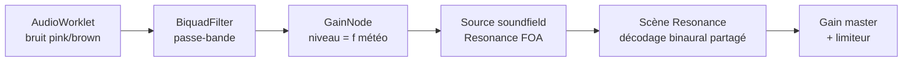

# Phase 1 — Couche 3 (diffus lointain)

> **Position** : première couche ajoutée après le socle (Phase 0). La plus simple (coût constant, pas de positionnement individuel), elle **valide la chaîne « nouvelle couche → mix → trace »** sur le cas le moins risqué.
> **Réf. spec** : §7 (Couche 3), §16.1 (décodage → source soundfield Resonance), §4.2 (rôle au diorama).
> **Pré-requis** : Phase 0 livrée — `WorldConfig`/échelle, PRNG seedé, événement `scale`, frontières `r1/r2`.

---

## 1. Objectif

Produire la **masse globale** de pluie : une nappe non localisable, immersive, à coût quasi constant, pilotée par la **météo** (pas par des impacts). Au diorama, c'est elle qui fournit le « wash » d'enveloppement que la Couche 1 seule ne peut pas donner (§4.2).

**Décision §16.1 appliquée** : la nappe est routée dans une **source soundfield de Resonance**, partageant l'unique décodage binaural déjà en place. Pas de décodeur ambisonic séparé.

---

## 2. Structures de données

```
# Configuration de la nappe (dérivée de LayerConfig.L3 + WeatherState)
BedConfig {
  noise:   'pink' | 'brown',     # couleur de bruit source
  ordre:   1,                     # ordre ambisonique (FOA) — fixe au diffus
  filtre:  { centreHz, largeurHz },  # passe-bande, modulé par la météo
  niveauMax: dB,                  # plafond à intensité pluie = 1
  mince:   bool                   # mode diorama (enveloppement réduit, §4.2)
}

# État courant (ce que la météo pilote)
BedState {
  niveau:  dB,                    # = f(intensitéPluie globale)
  centre:  Hz,                    # centre du passe-bande
  largeur: Hz,                    # largeur du passe-bande
  weatherSv: entier               # version d'état météo ayant déclenché le changement
}
```

`BedConfig` est résolu par le moteur d'échelle : à `worldRadius ≤ r1` (diorama), `mince = true` et `niveauMax` est abaissé.

---

## 3. Graphe audio



> Un **seul** décodage binaural (celui de la scène Resonance) — conforme à §16.1. La nappe entre dans le même `scene.output` que les voix HRTF de la Couche 1.

---

## 4. Pseudo-code

### 4.1 Worklet de bruit (`worklets/noise-processor.js`)

```
# AudioWorkletProcessor — génère un flux de bruit coloré continu.
# Pink : méthode de Paul Kellet (filtres en cascade, peu coûteuse).
# Brown : intégration de bruit blanc avec fuite (leaky integrator).
process(_, outputs):
    canal ← outputs[0][0]
    pour i de 0 à canal.length:
        blanc ← prng()*2 - 1            # PRNG seedé passé à l'init (cf. §6)
        si couleur == 'pink':
            # 7 pôles de Kellet — état porté entre blocs
            b0 ← 0.99886*b0 + blanc*0.0555179
            … (b1..b6)
            canal[i] ← (b0+b1+…+b6 + blanc*0.5362) * 0.11
        sinon:  # brown
            brun ← (brun + 0.02*blanc) / 1.02
            canal[i] ← brun * 3.5
    retourne true
```

### 4.2 Module `DiffuseBed.js` (game thread)

```
class DiffuseBed:
  construire(ctx, scene, cfg, prng):
    # bruit → passe-bande → gain → source soundfield Resonance
    self.noise ← new AudioWorkletNode(ctx, 'noise-processor', { seed: prng.fork() })
    self.bp    ← ctx.createBiquadFilter(); self.bp.type ← 'bandpass'
    self.gain  ← ctx.createGain()
    self.src   ← scene.createSource({ soundfield: true })   # FOA, §16.1
    self.noise → self.bp → self.gain → self.src.input
    self.applyConfig(cfg)

  # Pilotée par la météo : intensité → niveau + ouverture/centre du filtre.
  setWeather(weather, weatherSv, rec):
    niveau  ← lerpDb(SILENCE, cfg.niveauMax, weather.intensité)
    centre  ← map(weather.intensité → cfg.filtre.centreHz)
    largeur ← map(weather.intensité → cfg.filtre.largeurHz)
    rampVers(self.gain.gain, dbToLin(niveau), 80ms)   # pas de saut
    self.bp.frequency.value ← centre
    self.bp.Q.value         ← centre / largeur
    rec?.emit('bed', { niveau, filtre:{centre, largeur}, ordre: cfg.ordre, weatherSv })

  # Mode diorama (collapse §4.2) : enveloppement réduit, non localisé.
  setMince(on): cfg.mince ← on; recalibrer niveauMax
```

### 4.3 Intégration dans `RainSampler`

```
init():
    … (existant : scène Resonance, pool, banques)
    self.bed ← new DiffuseBed(self.ctx, self.scene, resolveBedConfig(worldCfg), self.prng)

# La météo (déjà suivie en delta dans DioramaApp) pilote la nappe.
setWeather(weather):
    self.bed.setWeather(weather, self.recorder?.stateVersion, self.recorder)
```

---

## 5. Schéma d'événement de trace

| `type` | Émis quand | Champs |
|--------|------------|--------|
| `bed` | la nappe change (météo, collapse) | `niveau` (dB), `filtre{centre, largeur}` (Hz), `ordre`, `weatherSv` |

Cohérent avec §13.2 (« Événements nouveaux »). Émis **au changement** uniquement (pas de flux continu : la nappe varie lentement).

```
# Vérifier la vie de la nappe au fil du temps
jq -r 'select(.type=="bed")|[.t,.niveau,.filtre.centre]|@tsv' trace.ndjson
```

---

## 6. Déterminisme

Le bruit doit être **rejouable** (I4). Le worklet reçoit une **graine dérivée** du PRNG maître à l'init (`prng.fork()`), et n'utilise **aucun** `Math.random` interne. Deux sessions même `seed` ⇒ même flux de bruit échantillon-proche (cf. limite §14.5 : déterminisme d'événements, pas bit-à-bit entre machines).

---

## 7. Étapes ordonnées

1. **`noise-processor.js`** — worklet pink/brown, état porté entre blocs, seedé.
2. **`DiffuseBed.js`** — graphe bruit→passe-bande→gain→soundfield, `setWeather`, `setMince`.
3. **Branchement** dans `RainSampler.init` + `setWeather`.
4. **Pilotage météo** depuis `DioramaApp` (la météo, déjà trackée, appelle `setWeather`).
5. **Collapse diorama** — à `worldRadius ≤ r1`, `mince = true` (complète le câblage Phase 0).
6. **Trace `bed`** émise dès la première ligne du module (conçue *avec*, I4).

---

## 8. Critères de test (Definition of Done)

- [ ] Pluie ON ⇒ nappe **continue** (aucune pulsation, aucun grain audible isolé).
- [ ] Intensité météo ↑ ⇒ `niveau` ↑ et filtre s'ouvre ; événements `bed` cohérents.
- [ ] Couche 1 + Couche 3 mixées **sans clipping** (`getMasterLevel` sous 0 dBFS, limiteur jamais en butée prolongée).
- [ ] Diorama : enveloppement présent **sans** voix HRTF supplémentaire (le compteur `busy` du pool ne bouge pas quand seule la nappe joue).
- [ ] Même `seed` ⇒ flux de bruit reproductible (mode B Phase 4 le confirmera).
- [ ] Boîte noire verte : tous les événements Couche 1 toujours émis (M2).

---

## 9. Risques spécifiques

| Risque | Mitigation |
|--------|------------|
| **Saturation du mix** dès qu'une 2ᵉ source entre | Surveiller le tap master ; poser le limiteur au master (§10.2) avant d'ajouter la nappe |
| **Bruit trop « blanc »/sifflant** | Calibrer pink vs brown + centre/largeur du passe-bande à l'oreille |
| **Pulsation** si le niveau saute aux changements météo | Rampes (`rampVers`, ~80 ms), jamais de `setValueAtTime` brut |
| **Worklet non chargé** (await module) | Charger `audioWorklet.addModule` avant `init`, garder un fallback silencieux tracé (`reject` raison `no-worklet`) |

---

## 10. Tâches d'exécution

> Format : **T-x — Titre** · `chemin` (new) / `chemin:ligne` (edit) → *Action* / *Signatures* / *Dépend* / *Test*. Valeurs résolues ci-dessous (`// calibrable` = valeur de départ concrète).
> **Valeurs résolues** : `niveauMax = -12 dBFS` · `niveauMaxMince = -18 dBFS` · rampe de niveau `80 ms` · mapping filtre (intensité `i` ∈ [0,1]) : `centreHz = 800 + 1700·i`, `largeurHz = 1500 + 3500·i` · coeffs pink = méthode de Paul Kellet (7 pôles).

**T-1.1 — Worklet de bruit** · `ds/ui_kits/diorama/worklets/noise-processor.js` (new)
- *Action* : `AudioWorkletProcessor` nommé `'noise-processor'`, génère pink (Kellet, coeffs §4.1) ou brown (intégrateur à fuite). État `b0..b6`/`brun` porté entre blocs. PRNG seedé reçu via `options.processorOptions.seed` (réimplémenter `mulberry32` dans le worklet — pas d'import cross-thread).
- *Signatures* : `class NoiseProcessor extends AudioWorkletProcessor` ; `process(_, outputs)` remplit `outputs[0][0]`. `registerProcessor('noise-processor', NoiseProcessor)`.
- *Dépend* : T-0.A1 (algo PRNG à recopier)
- *Test* : nœud instancié → sortie non nulle, RMS stable ; deux `seed` égaux → même flux.

**T-1.2 — Module `DiffuseBed`** · `ds/ui_kits/diorama/DiffuseBed.js` (new)
- *Action* : construire le graphe `noise → BiquadFilter(bandpass) → GainNode → src soundfield Resonance`. Méthodes `setWeather(weather, weatherSv, rec)` (rampe niveau 80 ms, pose `frequency`/`Q = centre/largeur`, émet `bed`) et `setMince(on)` (bascule `niveauMax`).
- *Signatures* : `export class DiffuseBed { constructor(ctx, scene, cfg, prng); setWeather(...); setMince(on) }` ; source via `scene.createSource({ soundfield: true })` (§16.1).
- *Dépend* : T-1.1, T-0.B1
- *Test* : `setWeather({intensité:1},...)` → `gain` ≈ `dbToLin(-12)` ; un event `bed` émis.

**T-1.3 — Charger le worklet avant l'init** · `ds/ui_kits/diorama/RainSampler.js:208` (début de `init`)
- *Action* : `await this.ctx.audioWorklet.addModule(new URL('./worklets/noise-processor.js', import.meta.url))` avant la création de la scène. Sur échec : `try/catch`, `bed` désactivé, `reject` raison `no-worklet`.
- *Dépend* : T-1.1
- *Test* : `init()` ne jette pas ; module listé dans `ctx.audioWorklet`.

**T-1.4 — Instancier & brancher la nappe** · `ds/ui_kits/diorama/RainSampler.js:249` (fin de `init`)
- *Action* : `this.bed = new DiffuseBed(this.ctx, this.scene, resolveBedConfig(this.cfg, this.bands), this.prng.fork())`. `resolveBedConfig` fixe `mince = (this.bands.collapse === 'diorama')`.
- *Dépend* : T-1.2, T-0.E1
- *Test* : après `init`, `getMasterLevel()` > -∞ avec pluie ON sans aucune voix busy (la nappe seule sonne).

**T-1.5 — Pilotage météo** · `ds/ui_kits/diorama/RainSampler.js` (nouvelle méthode) + `DioramaApp.jsx:166` (effet deltas)
- *Action* : `RainSampler.setWeather(weather)` délègue à `this.bed.setWeather(weather, this.recorder?.stateVersion, this.recorder)`. L'effet de deltas d'état (DioramaApp) appelle `sampler.setWeather({ intensité: state.rain ? state.density : 0, vent: state.windForce, dir: ... })` quand pluie/density/vent changent.
- *Dépend* : T-1.4
- *Test* : bouger `density` ⇒ events `bed` avec `niveau` croissant.

**T-1.6 — Collapse diorama** · `ds/ui_kits/diorama/RainSampler.js` (dans `setScale`, T-0.F3)
- *Action* : après recalcul des `bands`, appeler `this.bed?.setMince(this.bands.collapse === 'diorama')`.
- *Dépend* : T-1.4, T-0.F3
- *Test* : preset `diorama` ⇒ nappe en mode mince (`niveau ≤ -18 dB` à intensité 1).
