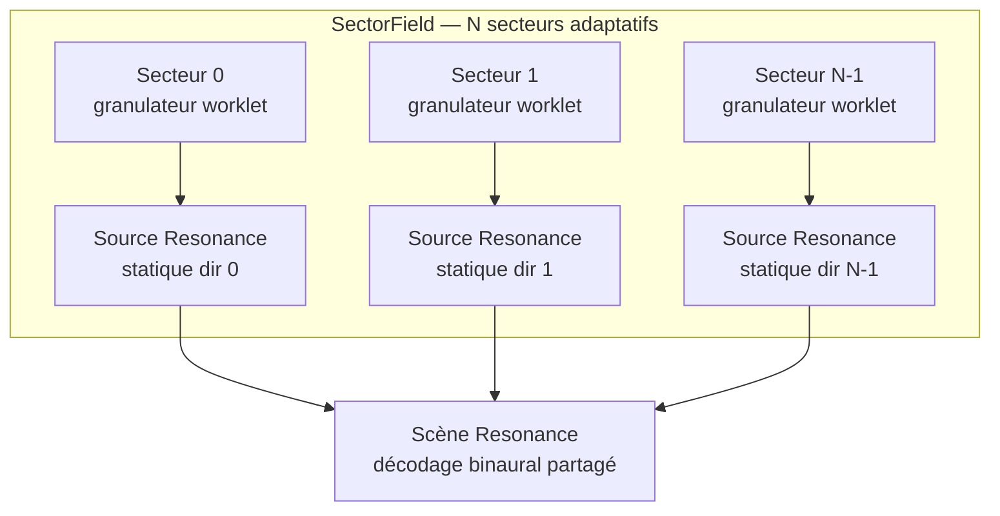
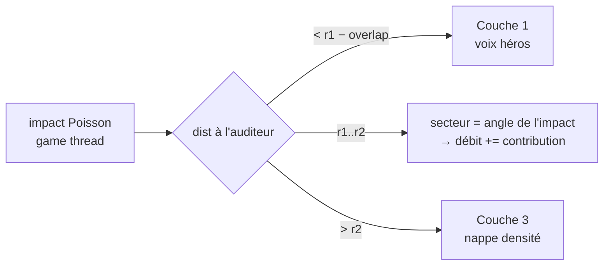

# Phase 2 — Couche 2 (texture moyenne, secteurs)

> **Position** : le **pont** entre les impacts distincts (Couche 1) et la nappe (Couche 3). Granulaire dense, **par secteurs adaptatifs**, non positionné individuellement.
> **Réf. spec** : §6 (Couche 2), §16.2 (secteurs adaptatifs à l'échelle), §5.5 (LOD d'entrée).
> **Pré-requis** : Phases 0 et 1 livrées — `WorldConfig`/échelle, PRNG seedé, Couche 3 au mix.

---

## 1. Objectif

Couvrir la plage `r1 – r2` : un tapis granulaire **directionnel** mais sans voix individuelle par goutte. Un impact au-delà de `r1 − overlap` n'est plus une voix héros — il **alimente la densité** du secteur qui le contient (§5.5). L'enveloppement directionnel émerge de `N` flux granulaires encodés chacun dans sa direction.

**Décision §16.2 appliquée** : `N` dérive de l'échelle — `room`=4, `courtyard`=8, `field`=12 ; au diorama la Couche 2 est **OFF** (collapse §4.2).

---

## 2. Structures de données

```
# Un secteur = une tranche directionnelle portant un flux granulaire.
Sector {
  index:     0..N-1,
  centreDir: (x,y,z),            # direction du secteur (normalisée, plan horizontal)
  débit:     grains/s,           # piloté par la densité locale
  matMix:    { matId → poids },  # couverture matériau du secteur
  occlusion: 0..1,               # murs/abris → atténuation + passe-bas
  worklet:   AudioWorkletNode,   # granulateur dédié
  src:       SourceResonance      # source statique Resonance à centreDir
}

# Champ de secteurs, résolu par l'échelle.
SectorField {
  N:        entier,              # 4 | 8 | 12 selon preset (§16.2)
  sectors:  [ Sector ],
  actif:    bool                 # false au diorama (collapse)
}

# Paramètres envoyés au worklet (par message, pas d'aléa partagé — cf. §6).
GranulatorParams {
  débit, matMix, occlusion,
  banques:  [ AudioBuffer ],     # grains du/des matériaux du secteur
  seed:     entier               # graine dérivée → Poisson reproductible
}
```

---

## 3. Graphe & flux



### Routage d'un impact selon la distance



---

## 4. Pseudo-code

### 4.1 Worklet granulateur (`worklets/granulator-processor.js`)

```
# AudioWorkletProcessor — un par secteur. Flux continu de grains courts,
# déclenché par un Poisson SEEDÉ (intervalles exponentiels), enveloppe courte,
# matériau pondéré, occlusion appliquée (gain + passe-bas).
process(_, outputs):
    canal ← outputs[0][0]
    pour i de 0 à canal.length:
        si self.tEcheance ≤ self.tCourant:
            self.lancerGrain()                         # nouveau grain
            self.tEcheance += -ln(self.prng())/self.débit   # prochain intervalle
        canal[i] ← self.mixerGrainsActifs(i)           # somme des grains en vol
        self.tCourant += 1/sampleRate
    appliquerPasseBas(canal, self.occlusion)           # filtre 1 pôle, coupé par l'occlusion
    retourne true

lancerGrain():
    mat   ← tirerMatériau(self.matMix, self.prng)      # round-robin pondéré
    buf   ← self.banques[mat][roundRobinIndex]
    pitch ← jitter(self.prng); gain ← jitter(self.prng) * (1 - self.occlusion)
    pousser un grain (buf, pitch, gain, enveloppe) dans self.grainsActifs

# Mise à jour des paramètres : message du game thread (jamais d'allocation ici).
onmessage(p):  self.débit ← p.débit; self.matMix ← p.matMix; self.occlusion ← p.occlusion
```

### 4.2 `SectorField.js` (game thread)

```
class SectorField:
  construire(ctx, scene, worldCfg, prng):
    self.N ← resolveSectorCount(worldCfg)              # 4|8|12 (§16.2), 0 si diorama
    self.actif ← self.N > 0
    pour k de 0 à N:
      dir ← directionDuSecteur(k, N)                   # 2π·k/N dans le plan horizontal
      w   ← new AudioWorkletNode(ctx, 'granulator-processor', { seed: prng.fork() })
      src ← scene.createSource()
      src.setPosition(...dir * RAYON_SECTEUR)           # statique, à mi-distance r1..r2
      w → src.input
      self.sectors.push({ index:k, centreDir:dir, worklet:w, src, … })

  # Un impact lointain alimente la densité du secteur qui le contient.
  absorberImpact(pos, material, head):
    k ← secteurPour(angle(pos - head), self.N)
    self.sectors[k].débit += contribution(material)    # lissé, decay dans update()

  # ~30 Hz : recalcule débit/occlusion/matMix par géométrie locale, pousse au worklet.
  update(terrain, head, rec):
    pour s dans self.sectors:
      s.occlusion ← occlusionLocale(terrain, head, s.centreDir)   # §6.3
      s.matMix    ← couvertureMatériau(terrain, head, s.centreDir)
      s.worklet.port.postMessage({ débit:s.débit, matMix:s.matMix, occlusion:s.occlusion })
      rec?.emit('sector', { sector:s.index, débit:s.débit, level:niveau(s),
                            occlusion:s.occlusion, matMix:s.matMix })
      s.débit *= DECAY                                  # retombe sans alimentation
```

### 4.3 Intégration `RainSampler`

```
trigger(...):                       # le Poisson de la Phase 0
    dist ← distance(pos, head)
    si dist < r1 - overlap:  self.pool.play(...)        # Couche 1 (existant)
    sinon si dist < r2:      self.sectors.absorberImpact(pos, material, head)  # Couche 2
    # (au-delà de r2 : la nappe Couche 3 porte déjà la masse — rien à router)
```

---

## 5. Schéma d'événement de trace

| `type` | Émis quand | Champs |
|--------|------------|--------|
| `sector` | enveloppe agrégée par secteur (~30 Hz) | `sector`, `débit` (grains/s), `level` (dB), `occlusion` (0..1), `matMix` |

**Pas d'événement par grain** (trop dense, §6.4) — on trace l'**enveloppe agrégée** par secteur, comme `faces` trace les voix.

```
# Vie d'un secteur (débit/niveau au fil du temps)
jq -r 'select(.type=="sector" and .sector==3)|[.t,.débit,.level]|@tsv' trace.ndjson
```

---

## 6. Déterminisme dans les worklets ⚠️

Point de conception clé : un worklet tourne sur l'**audio thread** et ne partage **pas** l'état du PRNG du game thread. Chaque granulateur reçoit une **graine dérivée** (`prng.fork()`) à sa construction et fait tourner son **propre** PRNG interne (même algorithme). Ainsi le flux de grains d'un secteur est reproductible sans communication par grain. Les *changements de paramètres* (débit, occlusion) restent journalisés via `sector` ⇒ le mode A (re-trigger) peut rejouer l'enveloppe sans la graine.

---

## 7. Étapes ordonnées

1. **`granulator-processor.js`** — Poisson seedé, mixage de grains, round-robin matériau, passe-bas d'occlusion.
2. **`SectorField.js`** — résolution `N` adaptative, création des secteurs (worklet + source statique), `update()` géométrique.
3. **Routage** dans `RainSampler.trigger` : `< r1−overlap` → Couche 1, `r1..r2` → secteur.
4. **Modulation géométrique** (`occlusionLocale`, `couvertureMatériau`) depuis le `Terrain`.
5. **Boucle `update`** ~30 Hz (game thread) poussant les params aux worklets.
6. **Trace `sector`** émise dans `update`.

---

## 8. Critères de test (Definition of Done)

- [ ] Secteurs **directionnels** : déplacer la densité d'un côté ⇒ l'enveloppement se déplace à l'oreille.
- [ ] Un secteur sous abri ⇒ `occlusion` ↑, `level` ↓ dans la trace.
- [ ] Transition Couche 1 → densité secteur **sans trou rythmique** ni saut de niveau (préfigure le crossfade Phase 3).
- [ ] `N` suit le preset : `room`=4, `courtyard`=8, `field`=12 ; **OFF** au diorama.
- [ ] Même `seed` ⇒ flux de grains de chaque secteur reproductible.
- [ ] Aucun **underrun** worklet à la densité max sur la plateforme cible.

---

## 9. Risques spécifiques

| Risque | Mitigation |
|--------|------------|
| **Coût CPU** des `N` granulateurs sur mobile | `N` adaptatif (4 sur mobile/room), grains courts, passe-bas léger |
| **Bord de secteur audible** (saut entre 2 directions) | Encodage ambisonic/panning doux ; à terme, partage d'énergie inter-secteurs |
| **Périodicité** du round-robin | ≥ 8 variations/matériau (§16.5) + jitter pitch/gain seedé |
| **Désync param** game→worklet (messages en retard) | Lissage (DECAY) côté débit ; le worklet tolère des params un peu vieux |
| **Allocation dans `process`** (GC audio) | Grains pré-alloués (pool de grains dans le worklet), zéro `new` par bloc |

---

## 10. Tâches d'exécution

> Format : **T-x — Titre** · `chemin` (new) / `chemin:ligne` (edit) → *Action* / *Signatures* / *Dépend* / *Test*.
> **Valeurs résolues** : `N` par preset = `{ room:4, courtyard:8, field:12, diorama:0 }` · `RAYON_SECTEUR = (r1 + r2) / 2` · `contribution(impact) = +2 grains/s` plafonné à `débitMax = 120` · `DECAY = 0.85` par tick `update` (~30 Hz) · enveloppe de grain `30 ms` (attaque 3 ms / chute 27 ms) · passe-bas d'occlusion : coupure `= 18000 − 16500·occlusion` Hz · pool de grains worklet = `64` grains pré-alloués.

**T-2.1 — Worklet granulateur** · `ds/ui_kits/diorama/worklets/granulator-processor.js` (new)
- *Action* : `AudioWorkletProcessor` `'granulator-processor'`. Boucle de Poisson seedée (intervalles `−ln(prng())/débit`), pool de `64` grains pré-alloués (zéro `new` dans `process`), enveloppe 30 ms, round-robin matériau pondéré par `matMix`, jitter pitch/gain, passe-bas 1 pôle piloté par `occlusion`. Params reçus via `port.onmessage`. PRNG seedé via `processorOptions.seed`.
- *Signatures* : cf. §4.1 (`process`, `lancerGrain`, `onmessage`). `registerProcessor('granulator-processor', …)`.
- *Dépend* : T-0.A1, T-1.3 (mécanisme `addModule`)
- *Test* : nœud instancié, `port.postMessage({débit:50,...})` → sortie granulaire ; même `seed` → même flux.

**T-2.2 — `SectorField`** · `ds/ui_kits/diorama/SectorField.js` (new)
- *Action* : `resolveSectorCount(cfg)` → `N` (table ci-dessus). Construire `N` secteurs : direction `dir(k) = (cos(2π k/N), 0, sin(2π k/N))`, worklet + `scene.createSource()` posée à `dir·RAYON_SECTEUR`. Méthodes `absorberImpact(pos, material, head)`, `update(terrain, head, rec)` (§4.2).
- *Signatures* : `export class SectorField { constructor(ctx, scene, cfg, bands, prng); absorberImpact(...); update(...); get actif() }`.
- *Dépend* : T-2.1, T-0.B2
- *Test* : `resolveSectorCount(roomCfg) === 4` ; `field` → 12 sources créées ; `diorama` → `actif === false`.

**T-2.3 — Instancier dans `RainSampler`** · `ds/ui_kits/diorama/RainSampler.js:249` (fin `init`)
- *Action* : `this.sectors = new SectorField(this.ctx, this.scene, this.cfg, this.bands, this.prng.fork())` (après la nappe T-1.4).
- *Dépend* : T-2.2
- *Test* : `init` OK ; `this.sectors.actif` cohérent avec le preset.

**T-2.4 — Routage par distance** · `ds/ui_kits/diorama/RainSampler.js:331` (dans `trigger`, après calcul `pos`)
- *Action* : remplacer l'appel direct `this.pool.play(...)` par un branchement : `dist = distance(pos, this._headWorld)` ; si `dist < r1 - overlap` → `pool.play(...)` (existant) ; sinon si `this.sectors.actif && dist < r2` → `this.sectors.absorberImpact(pos, material, this._headWorld)` (pas de voix héros) ; sinon (au-delà de `r2`) → rien (la nappe porte la masse).
- *Dépend* : T-2.3, T-0.E4
- *Test* : éloigner l'auditeur d'un impact → `busy` du pool n'augmente plus, mais le `débit` du secteur correspondant monte (event `sector`).

**T-2.5 — Boucle `update` ~30 Hz** · `ds/ui_kits/diorama/DioramaApp.jsx:182` (à côté de la boucle de trace)
- *Action* : RAF 1 frame/2 appelant `sampler.sectors?.update(terrain, headWorld, recorder)`. Tourne dès que l'écoute est active (pas seulement en enregistrement).
- *Dépend* : T-2.4
- *Test* : events `sector` émis à ~30 Hz pendant l'écoute ; `débit` retombe (DECAY) quand on cesse d'alimenter un secteur.

**T-2.6 — Modulation géométrique** · `ds/ui_kits/diorama/SectorField.js` (helpers) + `Terrain.js`
- *Action* : `occlusionLocale(terrain, head, dir)` (raycast court → 0..1) et `couvertureMatériau(terrain, head, dir)` (échantillonnage le long de `dir` → `matMix`). Au minimum viable : `occlusion = 0`, `matMix` = matériau dominant du secteur. Affiner ensuite.
- *Dépend* : T-2.5
- *Test* : un secteur pointant vers le bloc surélevé (relief T-0.D1) → `occlusion > 0` dans l'event `sector`.
