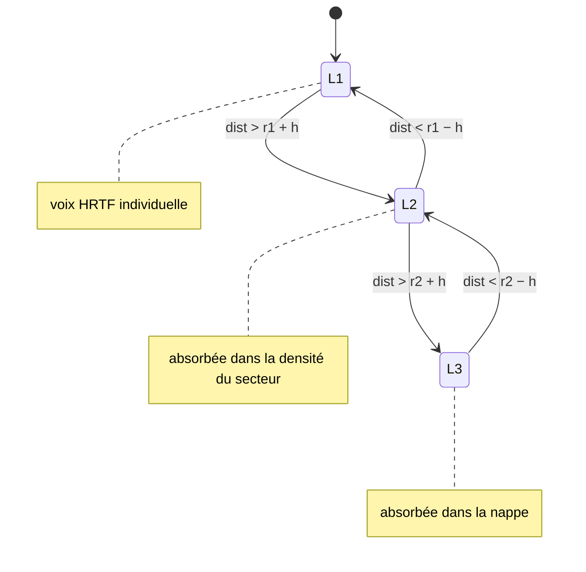

# Phase 3 — LOD & crossfades

> **Position** : **souder** les trois couches. Une source migre de couche selon sa distance, avec hystérésis et fondus à puissance constante — **aucune couture audible** (I7).
> **Réf. spec** : §8 (Crossfades & LOD), §16.4 (hystérésis `h`), §8.3 (LOD = levier de budget).
> **Pré-requis** : Phases 0-2 livrées — les trois couches existent et jouent ; il manque la **logique de migration** entre elles.

---

## 1. Objectif

Avant cette phase, le routage est **statique par seuil dur** (`< r1−overlap` → L1, `r1..r2` → L2, `> r2` → L3 ; cf. Phase 2). Cela suffit pour entendre chaque couche, mais une source pile sur une frontière **papillonne** et une transition brutale **claque**. La Phase 3 introduit :

1. le **crossfade à puissance constante** dans les zones de recouvrement,
2. une **machine à états LOD** avec **hystérésis** + anti-rebond,
3. le **LOD comme levier de budget** (sous pression, abaisser `r1`).

---

## 2. Structures de données

```
# État LOD d'une source suivie (voix héros candidate à la migration).
LodState {
  grain:    id,
  couche:   'L1' | 'L2' | 'L3',
  dist:     mètres,             # distance courante à l'auditeur
  tBascule: ms                  # dernière bascule (anti-rebond)
}

# Paramètres LOD, dérivés de l'échelle (jamais en dur — I3).
LodParams {
  r1, r2, overlap,             # de résoudreCouches() (§4.1)
  h:        mètres,            # hystérésis = clamp(0.5·overlap, 0.3, ∞)  (§16.4)
  debounce: ms                 # anti-rebond (~150 ms)
}
```

---

## 3. Crossfade à puissance constante (§8.1)

```
# t ∈ [0,1] : progression dans la zone de recouvrement [r−overlap, r].
fondu(t):
    g_haut ← sin(t · π/2)        # poids couche supérieure (plus lointaine)
    g_bas  ← cos(t · π/2)        # poids couche inférieure (plus proche)
    retourne (g_bas, g_haut)     # g_bas² + g_haut² = 1  → puissance constante
```

Dans la zone, une source contribue **aux deux couches** par ces poids : sa voix héros (L1) baisse en `g_bas` pendant que son énergie monte dans la densité du secteur (L2) en `g_haut`, et symétriquement L2↔L3.

---

## 4. Machine à états LOD avec hystérésis (§8.2)



- `h` (§16.4) crée une **bande morte** autour de chaque frontière : on ne bascule L1→L2 qu'à `r1+h`, on ne revient L2→L1 qu'à `r1−h`. La source doit *vraiment* franchir pour migrer.
- L'**anti-rebond** (`debounce`) bloque une re-bascule dans les ~150 ms suivant la précédente : couvre l'auditeur qui oscille pile sur la frontière.

```
# Évaluée par source suivie, à ~30 Hz.
évaluerLod(s, params, now, rec):
    si now - s.tBascule < params.debounce: retourne     # anti-rebond
    si s.couche == 'L1' et s.dist > params.r1 + params.h:
        démouvoir(s, 'L1', 'L2', rec)
    sinon si s.couche == 'L2' et s.dist < params.r1 - params.h:
        promouvoir(s, 'L2', 'L1', rec)
    sinon si s.couche == 'L2' et s.dist > params.r2 + params.h:
        démouvoir(s, 'L2', 'L3', rec)
    sinon si s.couche == 'L3' et s.dist < params.r2 - params.h:
        promouvoir(s, 'L3', 'L2', rec)
```

### Démotion / promotion

```
démouvoir(s, de, vers, rec):                 # ex. L1 → L2
    si de == 'L1':
        voix ← pool.voixDe(s.grain)
        relâcherAvecFondu(voix, FONDU)        # voix héros s'éteint proprement (pas de clic)
        secteurs.absorberImpact(voix.pos, voix.material, head)   # énergie versée en densité
    sinon:  # L2 → L3 : la densité du secteur reflue vers la nappe (réglage de niveaux)
        nappe.ajusterDepuisSecteur(s)
    s.couche ← vers; s.tBascule ← now
    rec?.emit('lod', { grain:s.grain, from:de, to:vers, dist:round(s.dist), reason:'dist' })

promouvoir(s, de, vers, rec):                # ex. L2 → L1
    si vers == 'L1' et pool.aDuBudget():
        pool.play(...)                        # redevient voix héros
    sinon:
        # budget saturé : reste en densité (la promotion échoue gracieusement)
        rec?.emit('lod', { grain:s.grain, from:de, to:de, dist:round(s.dist), reason:'no-budget' })
        retourne
    s.couche ← vers; s.tBascule ← now
    rec?.emit('lod', { grain:s.grain, from:de, to:vers, dist:round(s.dist), reason:'dist' })
```

---

## 5. LOD comme levier de budget (§8.3)

```
# ~1 Hz, ou sur événement de pression (pool saturé, vols en hausse).
ajusterBudget(stats, params, rec):
    si stats.busy ≥ 0.95 * stats.size ou stats.steals croît vite:
        params.r1 ← max(R1_MIN, params.r1 - PAS)   # moins de L1, plus de densité
    sinon si stats.busy < 0.5 * stats.size:
        params.r1 ← min(cfg.L1.rMax, params.r1 + PAS)   # rendre des voix héros
    rec?.emit('budget', { busyL1:stats.busy, sizeL1:stats.size, steals:stats.steals,
                          sectorsActive:secteurs.actifs(), r1Adj:params.r1 })
```

Abaisser `r1` rétrécit la zone des voix héros ⇒ moins de voix demandées, le surplus part en densité/nappe. C'est la soupape qui borne le budget (I2) sans coupure audible (la migration passe par le crossfade).

---

## 6. Schémas d'événements de trace

| `type` | Émis quand | Champs |
|--------|------------|--------|
| `crossfade` | une source franchit une zone de fondu | `grain?`, `from`, `to`, `g_bas`, `g_haut` |
| `lod` | promotion/démotion d'une source | `grain?`, `from`, `to`, `dist`, `reason` |
| `budget` | pression/ajustement budget (~1 Hz) | `busyL1`, `sizeL1`, `steals`, `sectorsActive`, `r1Adj` |

```
# Papillonnement : bascules A→B→A rapprochées (< 300 ms) — doit rester quasi nul
jq -c 'select(.type=="lod")|[.t,.grain,.from,.to]' trace.ndjson   # puis inspecter les allers-retours

# Coupures audibles : aucune voix volée AVANT sa fin pendant une démotion
jq 'select(.type=="steal" and .victim.remaining > 0)' trace.ndjson | wc -l   # → ~0
```

---

## 7. Étapes ordonnées

1. **`fondu(t)`** — utilitaire crossfade puissance constante.
2. **`LodController.js`** — suivi des sources, `évaluerLod`, démotion/promotion, hystérésis + anti-rebond.
3. **Câblage démotion** : L1 relâche la voix (fondu) → `SectorField.absorberImpact` ; L2↔L3 ajuste les niveaux.
4. **Câblage promotion** : L2→L1 réacquiert une voix si budget, échec gracieux sinon.
5. **`ajusterBudget`** — abaisse/relève `r1` sous pression ; émet `budget`.
6. **Traces `crossfade`/`lod`/`budget`** posées avec la logique (I4).

---

## 8. Critères de test (Definition of Done)

- [ ] Auditeur traversant lentement `r1` puis `r2` ⇒ **aucun clic, aucun trou** (écoute + `steal.remaining > 0` ≈ 0). *(M6)*
- [ ] **Pas de papillonnement** : sur un trajet nominal, bascules `lod` `A→B→A` rapprochées ≈ 0 (valide `h` et l'anti-rebond, §16.4).
- [ ] Sous pression (densité max), `r1` **s'abaisse** et `budget`/`lod` le tracent ; le nombre de `steal` se stabilise.
- [ ] Promotion **échoue gracieusement** quand le pool est plein (la source reste en densité, `reason:no-budget`), sans glitch.
- [ ] Transition L1↔L2 **iso-énergie** : pas de bosse ni de creux de niveau au passage (vérif `faces`/`sector`).

---

## 9. Risques spécifiques

| Risque | Mitigation |
|--------|------------|
| **Papillonnement** résiduel | `h` proportionnelle + anti-rebond ; calibrer via les allers-retours `lod` |
| **Saut d'énergie** L1↔L2 (la densité ne « rattrape » pas la voix perdue) | Crossfade puissance constante ; vérifier la continuité `faces`↔`sector` |
| **Oscillation du budget** (`r1` qui pompe) | Pas (`PAS`) petit + hystérésis sur les seuils busy (0.95 / 0.5) |
| **Latence perçue** au déplacement si `h` trop grand | Borne haute sur `h` ; tester un déplacement rapide |
| **Coût du suivi** par source à 30 Hz | Ne suivre que les sources proches des frontières (fenêtre `[r−overlap−h, r+overlap+h]`) |
