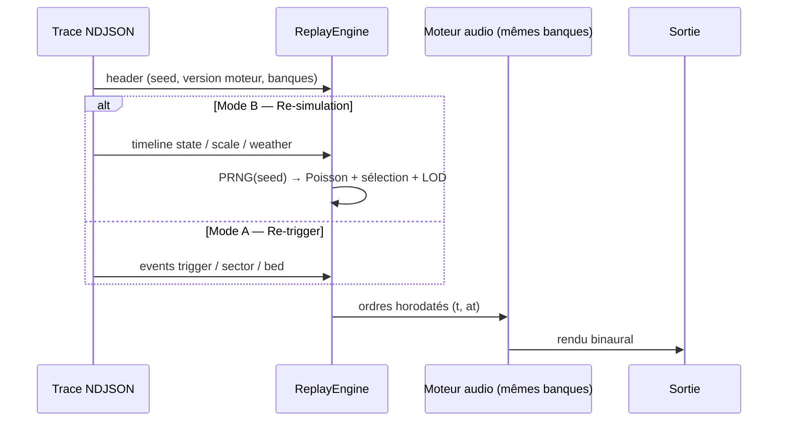

# Phase 4 — Threads, budgets & durcissement

> **Position** : dernière phase. Honore la **séparation des threads** (I6), les **budgets plateforme** (I2), le **replay complet** (§14) et les optimisations finales.
> **Réf. spec** : §9 (Orchestration & threads), §12 (Budgets), §14 (Replay déterministe), §12.3 (leviers d'optimisation).
> **Pré-requis** : Phases 0-3 livrées — moteur fonctionnel 3 couches + LOD ; tout l'aléa est seedé (Phase 0).

---

## 1. Objectif

Le moteur **sonne** déjà juste (Phases 0-3). La Phase 4 le rend **robuste et rejouable** :

1. **Séparer game thread / audio thread** par ring buffer non bloquant (I6).
2. **Profils plateforme** : mobile / desktop / VR (voix, secteurs, ordre, sample rate).
3. **Optimisations** : culling par attention, coupe des grains négligeables, pré-mixage.
4. **Replay déterministe** complet : modes A (re-trigger) et B (re-simulation).

---

## 2. Séparation des threads (§9)

```mermaid
sequenceDiagram
  participant GT as Game thread<br/>(décision)
  participant RB as Ring buffer<br/>(SPSC, non bloquant)
  participant AT as Audio thread<br/>(worklets + Resonance)
  participant OUT as Sortie binaurale

  GT->>GT: météo → λ(t) ; Poisson (PRNG) ; sélection ; LOD
  GT->>RB: ordres (playImpact / setSector / setBed / setListener)
  RB->>AT: consommation non bloquante (par bloc audio)
  AT->>AT: granulateurs, sources HRTF, nappe
  AT->>OUT: mix + décodage binaural
  AT-->>GT: compteurs (busy, steals, niveaux) pour LOD/budget
```

### 2.1 Protocole de messages (ring buffer SPSC)

```
# Anneau pré-alloué (SharedArrayBuffer si dispo, sinon postMessage par lot).
# Un producteur (game thread), un consommateur (audio thread) → sans verrou.
Ordre {
  type:  PLAY_IMPACT | SET_SECTOR | SET_BED | SET_LISTENER | SET_SCALE,
  at:    secondes,              # horodatage audio cible (ordonnancement précis)
  args:  …                      # selon type (sérialisés en champs numériques)
}

# Retour audio→game : compteurs agrégés (pas par voix), lus à ~30 Hz.
Compteurs { busy, steals, niveauMaster, sectorsActive }
```

```
# Game thread — produit, ne bloque jamais.
postOrdre(o):  si ring.plein(): tracer('reject', raison:'ring-full'); sinon ring.push(o)

# Audio thread — consomme tout ce qui est dû pour le bloc courant.
onAudioBlock():
    tant que ring.tête.at ≤ tBlocFin: appliquer(ring.pop())
    rendre()                     # worklets + Resonance
    publierCompteurs()
```

> **Note PWA** (§9) : l'audio thread = `AudioWorkletProcessor` (Couches 2/3) + pipeline Resonance (Couche 1) ; le game thread = boucle applicative (`requestAnimationFrame`/worker). Aucun calcul lourd ne bloque le rendu audio.

---

## 3. Profils plateforme (§12.2)

```
# Résolus à l'init, dérivés de la plateforme détectée (ou choisis en UI debug).
PlatformPreset {
  voicesL1, sectorsL2, ambisonicOrder, sampleRate
}
PRESETS = {
  mobile:  { voicesL1: 12-16, sectorsL2: 4,    order: 1,   sampleRate: 48k },
  desktop: { voicesL1: 32-48, sectorsL2: 8,    order: 1-2, sampleRate: 48k },
  vr:      { voicesL1: 48+,   sectorsL2: 8-12, order: 2-3, sampleRate: 48-96k },
}
```

Le pool fixe `48` et l'ordre `3` codés en dur aujourd'hui (`RainSampler.js:7,13`) deviennent des **dérivés** : `POOL_SIZE ← preset.voicesL1`, `AMBISONIC_ORDER ← preset.order`. `SectorField.N` recoupe `preset.sectorsL2` ∩ échelle (§16.2).

---

## 4. Optimisations (§12.3)

### 4.1 Coupe des grains négligeables

```
# Une voix dont le grain est passé sous le seuil audible est libérée tôt.
traceSample / boucle voix:
    db ← pool.level(v)
    si db < material.seuilWeakDb:
        rec?.emit('env', { …, db, weak: true })     # flag posé en Phase 0
        pool.couperAvecFondu(v, 5ms); pool._release(v)   # rend la voix au budget
```

### 4.2 Culling par attention (§5.3)

`attention` (déjà dans la formule de priorité, Phase 0) abaisse la priorité des sources hors champ de vision/focus ⇒ elles sont volées en premier sous pression. Concentre le budget là où l'oreille écoute.

### 4.3 Pré-mixage des textures denses (§7)

Les nappes/secteurs très denses peuvent être **bakés** hors temps réel et relus comme soundfield (coût constant) plutôt que synthétisés en direct — bascule transparente derrière l'interface `DiffuseBed`/`SectorField`.

---

## 5. Replay déterministe complet (§14)



| Mode | Entrée | Reconstruit | Usage |
|------|--------|-------------|-------|
| **A — Re-trigger** | `trigger`/`sector`/`bed` de la trace | rejoue les ordres tels quels | rejeu fidèle même sans la graine |
| **B — Re-simulation** | `header.seed` + timeline `state`/`scale`/`weather` | re-déroule Poisson + sélection + LOD à l'identique | tester une variante du moteur sur la même entrée |

```
# ReplayEngine — mode A : rejoue les ordres horodatés.
replayA(trace, engine):
    pour e dans trace où e.type ∈ {trigger, sector, bed}:
        planifier(engine, e, à e.at)        # même graphe Web Audio qu'en live

# Mode B : re-simule depuis la graine et la timeline d'état.
replayB(trace, engine):
    prng ← PRNG(trace.header.seed)
    rejouer state/scale/weather comme entrée du game thread
    laisser le moteur re-tirer Poisson/sélection/LOD avec prng
    # Toute divergence d'événements vs live = régression à investiguer (§14.5)
```

**Ce que la trace doit capturer** (déjà posé Phases 0-3, à vérifier) : `seed` + version moteur (`header`), timeline d'état complète en deltas (`state`/`scale`/`weather`), paramètres reproductibles par grain (`sample`/`detune`/`gainDb` dans `trigger`), banques référencées par id/version.

---

## 6. Schéma d'événement de trace

| `type` | Émis quand | Champs |
|--------|------------|--------|
| `budget` | pression/ajustement budget (~1 Hz) | `busyL1`, `sizeL1`, `steals`, `sectorsActive`, `r1Adj` |

(les autres événements de cette phase — `env.weak`, `lod reason:no-budget` — ont été posés en Phases 0/3 ; la Phase 4 les rend **actionnables**.)

```
# Voix gaspillées par des grains négligeables (doit chuter après §4.1)
jq 'select(.type=="env" and .weak==true)' trace.ndjson | wc -l
```

---

## 7. Étapes ordonnées

1. **`ringBuffer.js`** — SPSC pré-alloué (SharedArrayBuffer + fallback), protocole d'ordres.
2. **Bascule décision→message** : `RainSampler`/`RainManager` produit des ordres ; l'audio thread consomme.
3. **Compteurs audio→game** pour LOD/budget (remplace la lecture directe des analysers cross-thread).
4. **Profils plateforme** : `POOL_SIZE`/`AMBISONIC_ORDER`/`N` dérivés du preset détecté.
5. **Coupe des grains faibles** (`seuilWeakDb`) + **culling attention** activés.
6. **`ReplayEngine.js`** — modes A et B ; UI debug pour charger une trace et la rejouer.
7. **`budget`** émis à ~1 Hz.

---

## 8. Critères de test (Definition of Done)

- [ ] Aucun **underrun** worklet sous charge max (le rendu audio ne bloque jamais sur le game thread). *(I6)*
- [ ] **Mode B identique** : re-simulation depuis `seed` + timeline ⇒ flux d'événements *identique* au live (toute divergence = régression, §14.5).
- [ ] **Mode A fidèle** : re-trigger d'une trace ⇒ même rendu perceptuel sans la graine.
- [ ] **Profils effectifs** : mobile = 12-16 voix / ordre 1 / 4 secteurs ; VR = 48+ / ordre 2-3.
- [ ] **Grains faibles coupés** : `env.weak==true` ⇒ voix réellement libérée (le compteur chute, `busy` baisse à densité égale).
- [ ] Boîte noire toujours verte de bout en bout (M2) ; replay reproductible (M3).

---

## 9. Risques spécifiques

| Risque | Mitigation |
|--------|------------|
| **`SharedArrayBuffer` indisponible** (en-têtes COOP/COEP) | Fallback `postMessage` par lot ; tracer le mode de transport |
| **Divergence live↔replay** (ordre de tirage PRNG) | Discipline stricte : un seul ordre de consommation du PRNG, figé ; `prng.fork()` documenté par sous-système |
| **Coût de la coupe** (analyse RMS par voix) | Réutiliser les analysers existants ; ne couper que sous seuil franc |
| **Latence ordre→rendu** (ring buffer) | Horodatage `at` des ordres + petite avance de planification |
| **Régression de détermin­isme** introduite par une optim | Test « même seed ⇒ même trace » en garde de non-régression à chaque commit |

---

## 10. Tâches d'exécution

> Format : **T-x — Titre** · `chemin` (new) / `chemin:ligne` (edit) → *Action* / *Signatures* / *Dépend* / *Test*.
> **Valeurs résolues** : presets plateforme `mobile = {voicesL1:14, sectorsL2:4, order:1, sampleRate:48000}` · `desktop = {40, 8, 2, 48000}` · `vr = {64, 12, 3, 48000}` · `seuilWeakDb = -45 dBFS` (déjà dans `LayerConfig.L1`) · ring `capacity = 1024` ordres · lot fallback `postMessage = 64` ordres · compteurs audio→game à `30 Hz`.

**T-4.1 — Ring buffer SPSC** · `ds/ui_kits/diorama/ringBuffer.js` (new)
- *Action* : anneau mono-producteur/mono-consommateur sur `SharedArrayBuffer` si dispo (en-têtes COOP/COEP), sinon fallback `postMessage` par lots de 64. API `push(ordre)` (non bloquant, retourne `false` si plein) / `pop()` / `peekAt()`.
- *Signatures* : `export function makeRing(capacity)` ; ordres encodés en champs numériques (`type`, `at`, `args[]`).
- *Dépend* : —
- *Test* : `push`×N puis `pop`×N rend l'ordre FIFO ; `push` sur plein → `false`.

**T-4.2 — Détection plateforme & presets** · `ds/ui_kits/diorama/worldConfig.js`
- *Action* : `detectPlatform()` → `'mobile'|'desktop'|'vr'` (UA + `XRSystem` si présent) ; `PLATFORM_PRESETS` (table ci-dessus) ; `makeWorldConfig` accepte `platform` et reporte `voicesL1/order/sectors` dans `layers`.
- *Dépend* : T-0.B1
- *Test* : `makeWorldConfig({preset:'field', platform:'mobile'}).layers.L1.voices === 14`.

**T-4.3 — Pool & ordre dérivés du preset** · `ds/ui_kits/diorama/RainSampler.js:7,13`
- *Action* : finaliser T-0.E2 — `POOL_SIZE`/`AMBISONIC_ORDER` proviennent de `cfg.layers.L1.voices` / `cfg.ambisonicOrder` (résolus par plateforme). Plus aucune const en dur.
- *Dépend* : T-4.2, T-0.E2
- *Test* : `poolStats().size` suit la plateforme ; `grep "POOL_SIZE = 48"` → vide.

**T-4.4 — Bascule décision→message** · `ds/ui_kits/diorama/RainSampler.js`
- *Action* : `trigger`/`setSector`/`setBed`/`setListener` produisent des **ordres** (`ring.push`) ; un consommateur côté audio (ou un adaptateur transitoire main-thread) applique les ordres horodatés. Étape transitoire admise : ring même thread d'abord, vrai worker ensuite.
- *Dépend* : T-4.1
- *Test* : aucun underrun worklet sous charge ; ordres appliqués dans l'ordre `at`.

**T-4.5 — Compteurs audio→game** · `ds/ui_kits/diorama/RainSampler.js:413` (`poolStats`)
- *Action* : publier `Compteurs{busy,steals,niveauMaster,sectorsActive}` à 30 Hz vers le game thread (remplace la lecture directe d'analysers cross-thread pour LOD/budget).
- *Dépend* : T-4.4
- *Test* : `LodController`/`ajusterBudget` consomment ces compteurs (plus d'accès direct au pool depuis la boucle React).

**T-4.6 — Coupe des grains faibles** · `ds/ui_kits/diorama/RainSampler.js:342` (`traceSample`/boucle voix)
- *Action* : quand `db < material.seuilWeakDb`, émettre `env{weak:true}` (T-0.F2) **puis** `pool.couperAvecFondu(v,0.005)` + `pool._release(v)`. Rend la voix au budget.
- *Dépend* : T-0.F2
- *Test* : `jq 'select(.type=="env" and .weak==true)' | wc -l` chute après activation ; `busy` baisse à densité égale.

**T-4.7 — Culling par attention** · `ds/ui_kits/diorama/RainSampler.js` (`_lowestPriority`, T-0.E3)
- *Action* : remplacer `attention = 1` par `attention = dansChampDeVision(v.pos, head, forward) ? 1 : 0.4 // calibrable`.
- *Dépend* : T-0.E3
- *Test* : une voix hors champ est volée avant une voix de même gain/dist dans le champ (events `steal.victim`).

**T-4.8 — `ReplayEngine` (modes A & B)** · `ds/ui_kits/diorama/ReplayEngine.js` (new)
- *Action* : `replayA(trace, engine)` planifie les ordres `trigger/sector/bed` à leur `at` ; `replayB(trace, engine)` recrée `makePrng(header.seed)`, rejoue la timeline `state/scale/weather` comme entrée et laisse le moteur re-tirer Poisson/sélection/LOD. UI debug : charger un `.ndjson` et lancer A ou B.
- *Signatures* : `export class ReplayEngine { loadNDJSON(text); replayA(engine); replayB(engine) }`.
- *Dépend* : T-0.F1 (seed au header), T-4.4
- *Test* : **mode B** depuis une trace de référence ⇒ flux d'events `trigger` **identique** au live (toute divergence = régression, §14.5).

**T-4.9 — Événement `budget`** · finalisation
- *Action* : vérifier que `ajusterBudget` (T-3.5) émet `budget` à 1 Hz avec `sectorsActive` issu des compteurs (T-4.5).
- *Dépend* : T-3.5, T-4.5
- *Test* : `jq 'select(.type=="budget")' trace.ndjson` ≈ 1 ligne/s pendant l'écoute.
